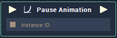

# Overview

**Pause Animation** **Node** accepts an **InstanceID** of a **Play Animation** **Node** and then proceeds to pause the animation.

# Inputs

|Input|Type|Description|
|---|---|---|
|*Pulse Input* (►)|**Pulse**|A standard **Input Pulse**, to trigger the execution of the **Node**.|
|`Instance ID`|**InstanceID**|The **InstanceID** of a **Play Animation** **Node**.|

# Outputs

|Output|Type|Description|
|---|---|---|
|*Pulse Output* (►)|**Pulse**|A standard **Output Pulse**, to move onto the next **Node** along the **Logic Branch**, once this **Node** has finished its execution.|

# See Also
[**Play Animation**](play-animation.md)

[**Stop Animation**](stop-animation.md)

