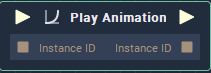

# Overview

The **Node** accepts a created animation instance and plays the animation.

# Attributes
## Animation

|Attribute|Type|Description|
|---|---|---|
|`File`|**AnimationID**|The animation you wish to play. This file with a file extension *.incani* can be created in the **Animation Editor** |

# Inputs

|Input|Type|Description|
|---|---|---|
|*Pulse Input* (►)|**Pulse**|A standard **Input Pulse**, to trigger the execution of the **Node**.|
|`Instance ID`|**InstanceID**|**InstanceID** of an **Animation** **Node** thus **Pause Animation**, **Play Animation** or **Stop Animation**.|

# Outputs

|Output|Type|Description|
|---|---|---|
|*Pulse Output* (►)|**Pulse**|A standard **Output Pulse**, to move onto the next **Node** along the **Logic Branch**, once this **Node** has finished its execution.|
|`Instance ID`|**InstanceID**|**InstanceID** of the **Play Animation** **Node**.|

# See Also
[**Pause Animation**](pause-animation.md)

[**Stop Animation**](stop-animation.md)

