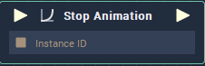

# Overview

Purpose of this **Node** is to stop a playing animation. The **Node** for example can accept an instance of a **Play Animation** **Node** and then proceed to stop the animation.

# Inputs

|Input|Type|Description|
|---|---|---|
|*Pulse Input* (►)|**Pulse**|A standard **Input Pulse**, to trigger the execution of the **Node**.|
|`Instance ID`|**InstanceID**|**InstanceID** of a **Node** you wish to perform a **Stop Animation** operation on.|

# Outputs

|Output|Type|Description|
|---|---|---|
|*Pulse Output* (►)|**Pulse**|A standard **Output Pulse**, to move onto the next **Node** along the **Logic Branch**, once this **Node** has finished its execution.|

# See Also
[**Play Animation**](play-animation.md)

[**Pause Animation**](pause-animation.md)

