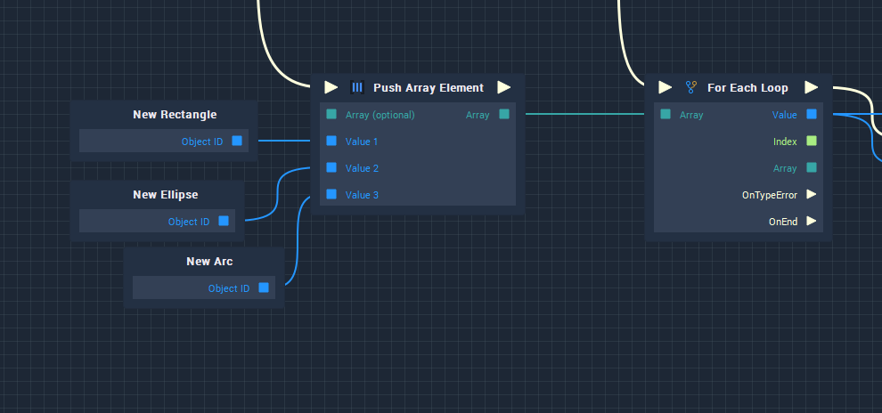
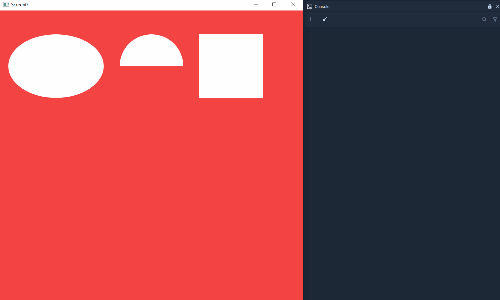

# Actions

## Introduction

The **Actions Nodes** are primarily used for generating an **Animation** through a continuous modification of the **Transformation Attributes** of an **Object**. They have two **Output Pulses**:

  *  `OnStart` \(►\) gets triggered when the **Action** begins.
  *  `OnEnd` \(►\) gets triggered when the **Action** finishes.

These **Nodes** take as inputs the **Object ID** of the **Object** to be modified, the duration of the **Action** (in seconds), and values to generate the **Animation**, such as the target value.

The **Node** name shows which **Attribute** is modified and which values are set by the user. The first part of the name says which **Attribute** the **Node** modifies:

  * `Fade` modifies `Opacity`
  * `Move` modifies `Position`
  * `Rotate` modifies `Rotation`
  * `Scale` modifies `Scale`

And the second part of the name says which values are specified by the user:

  * `FromTo`: The start and end values of the **Attribute** are set by the user.
  * `To`: Only the target value of the **Attribute** is set by the user.
  * `By`: The values to be added to the current value of the **Attribute** are set by the user.

Then, for instance, the **MoveTo Action** **Node** continuously modifies the `Position` **Attribute** of an **Object** until reaching the target value set, creating an **Animation** in which the **Object** moves from its current *position* to the one set in the **Node**.

### Instance ID

Each **Action** has an **Instance ID**, which is a unique identifier that can be set with the [**Create CustomID Node**](../utilities/createcustomid.md) in the `Instance ID` **Input Socket**. It is also possible to use an **Object ID** as **Instance ID**. The default **Instance ID** for **Actions** is 0.

There is one usage example that shows how useful it is to use the **Object ID** as the **Instance ID** for an **Action**: performing a chain of **Actions** over a set of **Objects**. In this case, having the **Object ID** as **Instance ID** allows the user to distinguish over which **Object** an **Action** is being performed.

Let us go over a quick example of this:

Consider three **Objects** (a rectangle, an ellipse, and an arc) and a chain of two **Actions** (**MoveBy** and **RotateBy**) we would like to perform over these **Objects**. We construct the **Logic** in the following way:

  * Build an **Array** containing the **Object IDs** of the three **Objects**.
  * Use a **For Each Loop** to go over the three elements of the **Array**.
  * Take the values of the **Array** outputted by the **For Each Loop Node** and give them to a sequence of **Action Nodes** as both the **Object ID** and **Instance ID**.

With this, after the **Actions** have being performed, we are able to use the **Object IDs** of the **Objects**. In this case, we print them to the **Console**.

The **Logic** for this example is the following:

And the played example:

### Interpolation

The method of *interpolation* used for generating the intermediate values of the modified **Object Attribute** can be chosen in the **Node Attributes**. The options are:

  * [*Linear*](https://en.wikipedia.org/wiki/Linear_interpolation)
  * [*Sine Ease In*](https://easings.net/#easeInSine)
  * [*Sine Ease In Out*](https://easings.net/#easeInOutSine)
  * [*Sine Ease Out*](https://easings.net/#easeOutSine) 

## Contents

* [**Delay Action**](delayaction.md)
* [**FadeFromTo Action**](fadefromtoaction.md)
* [**FadeTo Action**](fadetoaction.md)
* [**MoveBy Action**](movebyaction.md)
* [**MoveTo Action**](movetoaction.md)
* [**RotateBy Action**](rotatebyaction.md)
* [**RotateTo Action**](rotatetoaction.md)
* [**RotateFromTo Action**](rotatefromtoaction.md)
* [**ScaleBy Action**](scalebyaction.md)
* [**ScaleTo Action**](scaletoaction.md)

## See Also

* [**4 Methods of Animation - 4. Actions**](../../demo-projects/4-methods-of-animation.md#4-actions)

