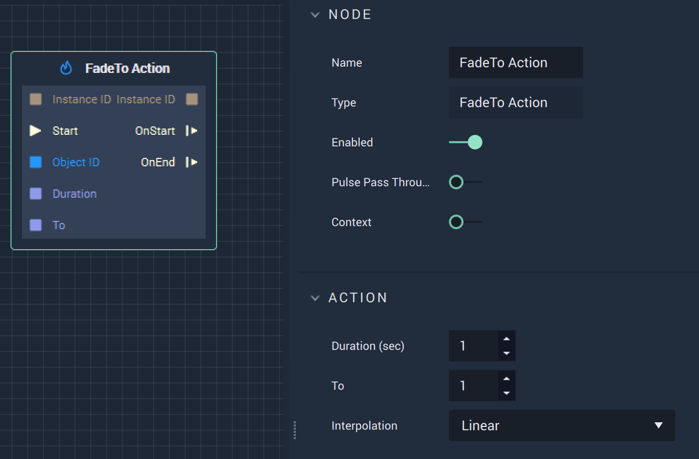

# Overview

The **FadeTo Action Node** diminishes the opacity of an **Animation** to the desired value over a specified time period, in either **Attributes** or **Inputs**.

# Attributes

|Attribute|Type|Description|
|---|---|---|
|`Duration`|**Float**|The total time of the **Action**.|
|`To`|**Float**|The desired opacity value at the end of the **Action**.|
|`Interpolation`|**Dropdown**|The `Interpolation` type. Can be Linear, Sine Ease In, Sine Ease Out, or Sine Ease In Out.|

# Inputs

|Input|Type|Description|
|---|---|---|
|`Instance ID`| **InstanceID** | The assigned **Instance** of an **Object**.|
|(►) `Start`|**Pulse**|A standard **Input Pulse**, to trigger the execution of the **Node**.|
|`Object ID`|**ObjectID**|The ID of the target **Object**.|
|`Duration`|**Float**|The total time (in seconds).|
|`To`|**Float**| The desired opacity at the end of the **Action**.|

# Outputs

|Output|Type|Description|
|---|---|---|
|`Instance ID`|**InstanceID**|The assigned **Instance** of an **Object**.|
|`OnStart` (►)|**Pulse**|Flows to additional actions following **FadeTo Action** if the **Action** is executed.|
|`OnEnd` (►)|**Pulse**|Flows to additional actions following **FadeTo Action** if the **Action** stops.|

# See Also

# External Links

* [_Transparency \(graphic\)_](https://en.wikipedia.org/wiki/Transparency_%28graphic%29) on Wikipedia.