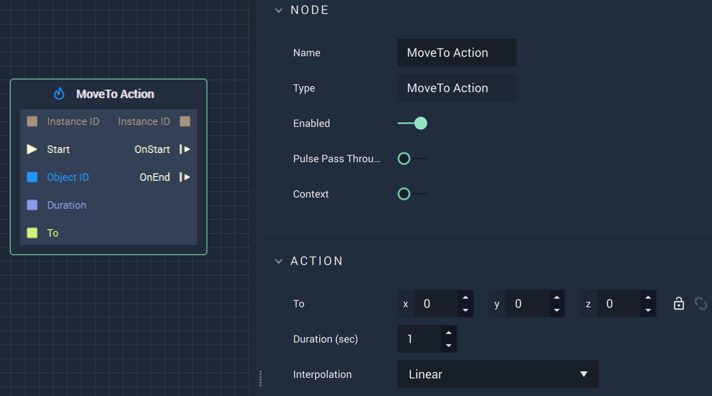

# Overview

The **Move To Action Node** moves an **Animation** to the coordinates specified in the `Offset` for the `Duration` (in seconds), in either **Attributes** or **Inputs**. 

# Attributes

|Attribute|Type|Description|
|---|---|---|
|`Offset`|**Vector3**|???.|
|`Duration`|**Float**|The total time of the **Action**.|
|`Interpolation`|**Dropdown**|The `Interpolation` type. Can be Linear, Sine Ease In, Sine Ease Out, or Sine Ease In Out.|

# Inputs

|Input|Type|Description|
|---|---|---|
|`Instance ID`| **InstanceID** | The assigned **Instance** of an **Animation**??.|
|(►) `Start`|**Pulse**|A standard **Input Pulse**, to trigger the execution of the **Node**.|
|`Object ID`|**ObjectID**|The ID of the target **Object**.|
|`Duration`|**Float**|The total time (in seconds).|
|`To`|**Vector3**|The desired *xyz* coordinates.|

# Outputs

|Output|Type|Description|
|---|---|---|
|`Instance ID`|**InstanceID**|The assigned **Instance** of an **Animation**??.|
|`OnStart` (►)|**Pulse**|Flows to additional actions following **MoveTo Action** if the **Action** is executed.|
|`OnEnd` (►)|**Pulse**|Flows to additional actions following **MoveTo Action** if the **Action** stops.|

# See Also

* [**MoveBy Action**](movebyaction.md)

# External Links

* [*Position (geometry)*](https://en.wikipedia.org/wiki/Position_(geometry)) on Wikipedia. 