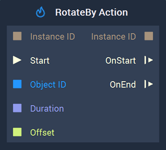

# RotateBy Action

## Overview

The **RotateBy Action Node** continuously rotates an **Object** by the *Euler angles* values specified in `Offset` for a given period of time, thus creating an **Animation**.

[**Scope**](../overview.md#scopes): *  **Scene**, **Function**, **Prefab**.

## Attributes

| Attribute | Type | Description |
| :--- | :--- | :--- |
| `Offset` | **Vector3** | The amount to rotate the **Object** by, measured in *Euler angles* along the X, Y, and Z axes, if none is received in the `Offset` **Input Socket**.|
| `Duration (sec)` | **Float** | The total time of the **Action**, if none is received in the `Duration` **Input Socket**. |
| `Interpolation` | **Drop-down** | The `Interpolation` method to use for calculating the intermediate values of the `opacity`. IT can be [*Linear*](https://en.wikipedia.org/wiki/Linear_interpolation), [*Sine Ease In*](https://easings.net/#easeInSine), [*Sine Ease In Out*](https://easings.net/#easeInOutSine), or [*Sine Ease Out*](https://easings.net/#easeOutSine). |

## Inputs

| Input | Type | Description |
| :--- | :--- | :--- |
| `Instance ID` | **InstanceID** | The assigned [**Instance ID**](README.md#instance-id) of the **Action**. If nothing is received, it automatically assigns 0 as the **Instance ID**. |
| \(►\) `Start` | **Pulse** | A standard **Input Pulse**, to trigger the execution of the **Node**. |
| `Object ID` | **ObjectID** | The ID of the target **Object**. |
| `Duration` | **Float** | The total time \(in seconds\). |
| `Offset` | **Vector3** | The amount to rotate the **Object** by, measured in *Euler angles* along the X, Y, and Z axes. |

## Outputs

| Output | Type | Description |
| :--- | :--- | :--- |
| `Instance ID` | **InstanceID** | The assigned [**Instance ID**](README.md#instance-id) of the **Action**.  |
| `OnStart` \(►\) | **Pulse** | Flows to the next **Node** following **RotateBy Action** when the **Action** starts. |
| `OnEnd` \(►\) | **Pulse** | Flows to the next **Node** following **RotateBy Action** when the **Action** stops. |

## See Also

* [**RotateTo Action**](rotatetoaction.md)
* [**RotateFromTo Action**](rotatefromtoaction.md)

## External Links

* [_Rotation_](https://en.wikipedia.org/wiki/Rotation) on Wikipedia
* [_Euler angles_](https://en.wikipedia.org/wiki/Euler_angles) on Wikipedia

