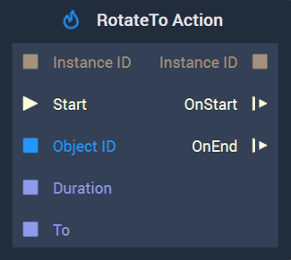
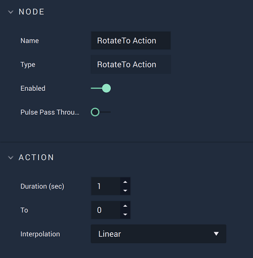

# RotateTo Action

This **Node** has different versions for [**Scenes**](../../objects-and-types/project-objects/scene.md) and [**Scene2Ds**](../../objects-and-types/project-objects/scene2d.md). Find in the tabs below the documentation for both versions.



### Overview

The **RotateTo Action Node** continuously rotates a [**Scene Object**](../../objects-and-types/scene-objects/) to the _Euler angles_ specified in `To` for a given period of time, thus creating an **Animation**.

Furthermore, visit the [**Actions Nodes**](./) page for a general introduction to these **Nodes**, and [**Rotation**](../../objects-and-types/attributes/common-attributes/transformation/#rotation) for more detail about the `Rotation` **Attribute**.

[**Scope**](../overview.md#scopes): **Scene**, **Function**, **Prefab**.

### Attributes

| Attribute        | Type          | Description                                                                                                                                                                                                                                                                                                                                      |
| ---------------- | ------------- | ------------------------------------------------------------------------------------------------------------------------------------------------------------------------------------------------------------------------------------------------------------------------------------------------------------------------------------------------ |
| `To`             | **Vector3**   | The _Euler angles_ along the X, Y, and Z axes to rotate to, if none are received in the `To` **Input Socket**.                                                                                                                                                                                                                                   |
| `Duration (sec)` | **Float**     | The total time of the **Action**, if none is received in the `Duration` **Input Socket**.                                                                                                                                                                                                                                                        |
| `Interpolation`  | **Drop-down** | The `Interpolation` method to use for calculating the intermediate values of the _Euler Angles_. It can be [_Linear_](https://en.wikipedia.org/wiki/Linear\_interpolation), [_Sine Ease In_](https://easings.net/#easeInSine), [_Sine Ease In Out_](https://easings.net/#easeInOutSine), or [_Sine Ease Out_](https://easings.net/#easeOutSine). |

### Inputs

| Input         | Type           | Description                                                                                                                                  |
| ------------- | -------------- | -------------------------------------------------------------------------------------------------------------------------------------------- |
| `Instance ID` | **InstanceID** | The assigned [**Instance ID**](./#instance-id) of the **Action**. If nothing is received, it automatically assigns 0 as the **Instance ID**. |
| (►) `Start`   | **Pulse**      | A standard **Input Pulse**, to trigger the execution of the **Node**.                                                                        |
| `Object ID`   | **ObjectID**   | The ID of the target **Object**.                                                                                                             |
| `Duration`    | **Float**      | The total time (in seconds).                                                                                                                 |
| `To`          | **Vector3**    | The _Euler angles_ along the X, Y, and Z axes to rotate to.                                                                                  |

### Outputs

| Output        | Type           | Description                                                                          |
| ------------- | -------------- | ------------------------------------------------------------------------------------ |
| `Instance ID` | **InstanceID** | The assigned [**Instance ID**](./#instance-id) of the **Action**.                    |
| `OnStart` (►) | **Pulse**      | Flows to the next **Node** following **RotateTo Action** when the **Action** starts. |
| `OnEnd` (►)   | **Pulse**      | Flows to the next **Node** following **RotateTo Action** when the **Action** stops.  |



### Overview

The **RotateTo Action Node** continuously rotates a [**Scene2D Object**](../../objects-and-types/scene-objects/) to the _Euler angles_ specified in `To` for a given period of time, thus creating an **Animation**.

Furthermore, visit the [**Actions Nodes**](./) page for a general introduction to these **Nodes**, and [**Rotation**](../../objects-and-types/attributes/common-attributes/transformation/#rotation) for more detail about the `Rotation` **Attribute**.

[**Scope**](../overview.md#scopes): **Scene**, **Function**, **Prefab**.

### Attributes

| Attribute        | Type          | Description                                                                                                                                                                                                                                                                                                                                      |
| ---------------- | ------------- | ------------------------------------------------------------------------------------------------------------------------------------------------------------------------------------------------------------------------------------------------------------------------------------------------------------------------------------------------ |
| `To`             | **Float**     | The value to rotate to, if none are received in the `To` **Input Socket**.                                                                                                                                                                                                                                                                       |
| `Duration (sec)` | **Float**     | The total time of the **Action**, if none is received in the `Duration` **Input Socket**.                                                                                                                                                                                                                                                        |
| `Interpolation`  | **Drop-down** | The `Interpolation` method to use for calculating the intermediate values of the _Euler Angles_. It can be [_Linear_](https://en.wikipedia.org/wiki/Linear\_interpolation), [_Sine Ease In_](https://easings.net/#easeInSine), [_Sine Ease In Out_](https://easings.net/#easeInOutSine), or [_Sine Ease Out_](https://easings.net/#easeOutSine). |

### Inputs

| Input         | Type           | Description                                                                                                                                  |
| ------------- | -------------- | -------------------------------------------------------------------------------------------------------------------------------------------- |
| `Instance ID` | **InstanceID** | The assigned [**Instance ID**](./#instance-id) of the **Action**. If nothing is received, it automatically assigns 0 as the **Instance ID**. |
| (►) `Start`   | **Pulse**      | A standard **Input Pulse**, to trigger the execution of the **Node**.                                                                        |
| `Object ID`   | **ObjectID**   | The ID of the target **Object**.                                                                                                             |
| `Duration`    | **Float**      | The total time (in seconds).                                                                                                                 |
| `To`          | **Float**      | The value to rotate to.                                                                                                                      |

### Outputs

| Output        | Type           | Description                                                                          |
| ------------- | -------------- | ------------------------------------------------------------------------------------ |
| `Instance ID` | **InstanceID** | The assigned [**Instance ID**](./#instance-id) of the **Action**.                    |
| `OnStart` (►) | **Pulse**      | Flows to the next **Node** following **RotateTo Action** when the **Action** starts. |
| `OnEnd` (►)   | **Pulse**      | Flows to the next **Node** following **RotateTo Action** when the **Action** stops.  |



## Example

This section shows a simple example of how to use the **RotateTo Action** **Node** and the effect it has on a **Scene Object**. This concept can be applied as well to a **Scene2D Object**.

We start by [configuring the **Scene**](rotatetoaction.md#scene-configuration), then [build the **Logic**](rotatetoaction.md#logic), and finally show the [result](rotatetoaction.md#final-result).

### Scene Configuration

We consider a [**Scene**](../../objects-and-types/project-objects/scene.md) with two [**Objects**](../../objects-and-types/scene-objects/): a red [**Torus**](../../objects-and-types/scene-objects/primitives.md#torus) and a [**Directional Light**](../../objects-and-types/scene-objects/lights.md), both of which can be easily created in the [**Scene Outliner**](../../modules/scene-outliner.md). Then, we set the `Scale` **Attribute** of the **Torus** to $$(2, 2, 2)$$ and the `Position` of the **Light** to $$(0, 200, 0)$$. See this configuration in the following image:

### Logic

We then need to configure the **Logic**. This is done in the [**Logic Editor**](../../modules/logic-editor.md).

We will use two **RotateTo Action** **Nodes** in order to first perform a _rotation_ and then reverse it. For the first one, we set the following **Attributes**:

* `To`: $$(90, 90, 0)$$
* `Duration (sec)`: $$2$$
* `Interpolation`: `Linear`

And for the second **Node**:

* `To`: $$(0, 0, 0)$$
* `Duration (sec)`: $$2$$
* `Interpolation`: `Linear`

Then, we connect to both **Nodes** the [**Object Node**](../../objects-and-types/scene-objects/#objects-in-the-logic) of the red **Torus**, a **Pulse** to the `Start` **Input Socket** of the first **RotateTo Action** and the **Output** `OnEnd` to the `Start` **Input** of the second **RotateTo Action** **Node**. Thus, having the following **Logic** configuration:

### Final result

Finally, the effect of the **RotateTo Action** **Node** when triggered is the following:

## See Also

* [**RotateBy Action**](rotatebyaction.md)
* [**RotateFromTo Action**](rotatefromtoaction.md)

## External Links

* [_Rotation_](https://en.wikipedia.org/wiki/Rotation) on Wikipedia
* [_Euler angles_](https://en.wikipedia.org/wiki/Euler\_angles) on Wikipedia
