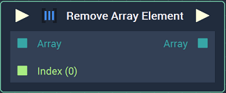
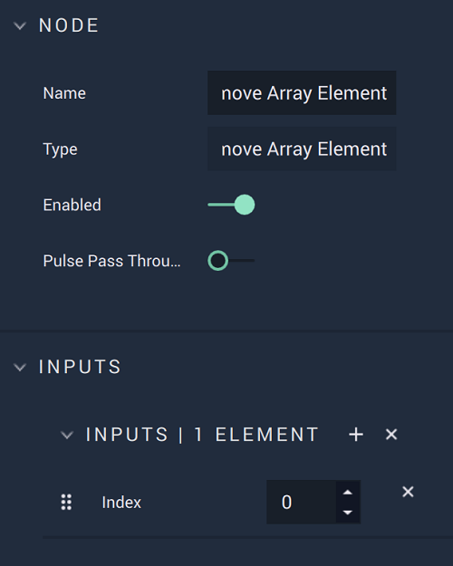

# Overview

The **Remove Array Element Node** deletes the element(s) of an **Array** at the specified index/indices. 

For example, an **Array** is populated as follows: $[0,3,6,9,12]$. If the `Indices` $1$ and $3$ are given, the elements at those indices are deleted and the user is left with a new **Array**: $[0,6,12]$. 

[**Scope**](../overview.md#scopes): **Project**, **Scene**, **Function**, **Prefab**.

# Attributes

|Attribute|Type|Description|
|---|---|---|
|`Inputs`|**Drop-down**|The index, or indices, of the element(s) to be removed, if one is not provided in the **Input Socket**.|
# Inputs

|Input|Type|Description|
|---|---|---|
|*Pulse Input* (►)|**Pulse**|A standard **Input Pulse**, to trigger the execution of the **Node**.|
|`Array`|**Array**|The **Array** whose element(s) will be removed.|
|`Index (0)`|**Int**|The index, or indices, of the element(s) to be removed.|

# Outputs

|Output|Type|Description|
|---|---|---|
|*Pulse Output* (►)|**Pulse**|A standard **Output Pulse**, to move onto the next **Node** along the **Logic Branch**, once this **Node** has finished its execution.|
|`Array`|**Array**|The augmented **Array** without the element(s) that were specified to be removed.|

