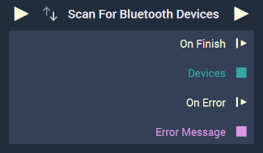

# Overview

The **Scan For Bluetooth Devices Node** searches for *Bluetooth* devices in the short-range vicinity and returns any found in an **Array** of **Dictionaries**. The *keys* of these **Dictionaries** are `Device Name`, `Device Address`, `Service Class`, and `Device Class`.

**Bluetooth Communication** in **Incari** is available as a plugin and is enabled as default. However, in the case that it is disabled in the **Plugins Editor**, it will not appear in the **Project Settings** and **Scan For Bluetooth Devices** will not show up in the [**Toolbox**](../../overview.md). Please refer to the [**Plugins Editor**](../../../modules/plugins/README.md) to find out more information.

[**Scope**](../../overview.md#scopes): **Project**, **Scene**.

# Inputs

|Input|Type|Description|
|---|---|---|
|*Pulse Input* (►)|**Pulse**|A standard **Input Pulse**, to trigger the execution of the **Node**.|

# Outputs

|Output|Type|Description|
|---|---|---|
|*Pulse Output* (►)|**Pulse**|A standard **Output Pulse**, to move onto the next **Node** along the **Logic Branch**, once this **Node** has finished its execution.|
|`On Finish`(►)|**Pulse**|An **Event Pulse** which is triggered if the scan has successfully finished.|
|`Devices`|**Array of Dictionaries**|An **Array** of **Dictionaries** containing all the found *Bluetooth* devices.|
|`On Error`(►)|**Pulse**|An **Event Pulse** that fires in the event of an error, namely that scanning failed.|
|`Error Message`|**String**|The error message in the event of an error.|

