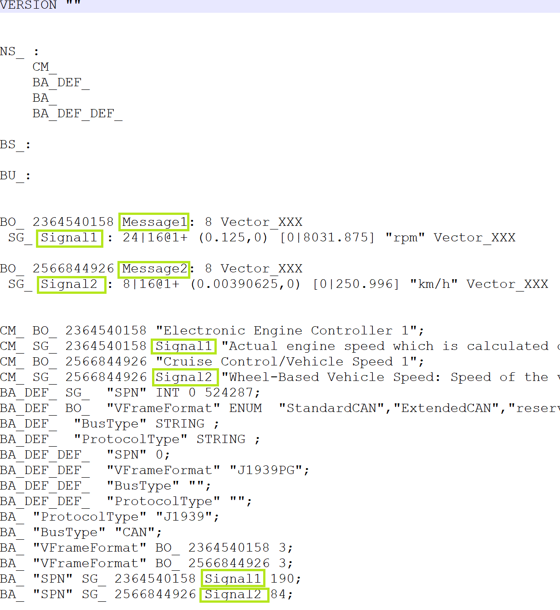
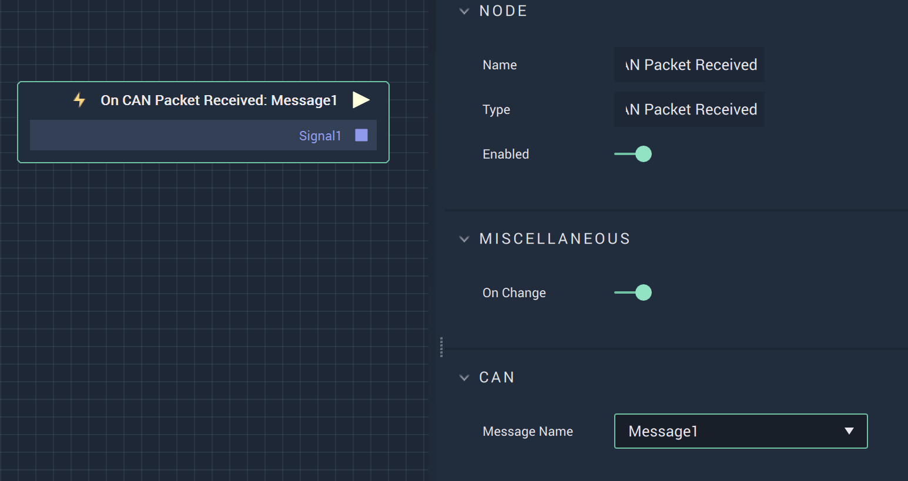

# On CAN Packet Received

## Overview

**On CAN Packet Received** is an **Event Listener Node** allowing the user to perform an action once a **CAN** `Message` is selected from the **Drop-down Menu** and a data **Packet** has been received.

[**Scope**](../../overview.md#scopes): **Project**, **Scene**.

## Attributes

| Attribute | Type | Description |
| :--- | :--- | :--- |
| `On Change` | **Bool** | Specifies whether the **Node** executes when a **Packet**'s `Message` changes or simply when a **Packet**'s `Message` is received. |
| `Message Name` | **Drop-down** | A `Message` that is chosen from the uploaded _DBC_ file. This is done in **Project Settings**. |

## Example

To visualize how the **Node** works a bit better, refer to the images below. The first is an example *DBC* file, which would have been added in the **CAN Project Settings**. There are two *Messages* and two *Signals*, each of which correspond to one of the *Messages*. 

When the connection has been added in **Project Settings** and those changes are saved, the user can select the desired `Message Name` -- here Message1 -- which will make an output appear called `Signal1`. If a *Message* has multiple *Signals* -- for example if Message1 had two *Signals* called Signal1a and Signal1b -- all appear as outputs of the **Node**. 

## Outputs

| Output | Type | Description |
| :--- | :--- | :--- |
| _Pulse Output_ \(►\) | **Pulse** | A standard **Output Pulse**, to move onto the next **Node** along the **Logic Branch**, once this **Node** has finished its execution. |

## See Also

* [**On CAN Start**](oncanstart.md)
* [**On CAN Stop**](oncanstop.md)

