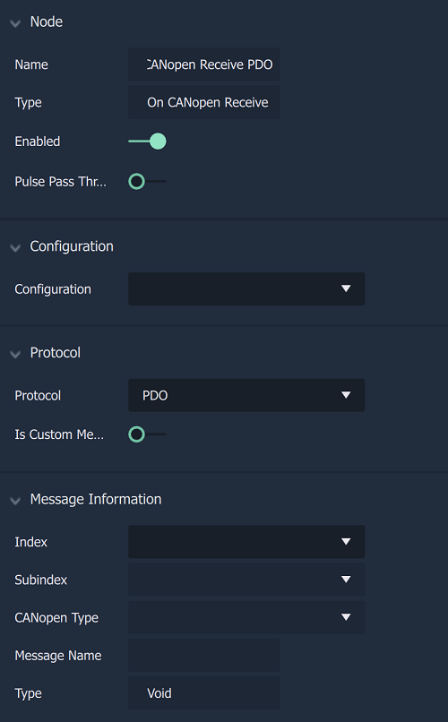

# Overview

**On CANopen Receive Node** is an **Event Listener Node** allowing the user to perform an action once a **CANopen** `Configuration` is selected from the **Drop-down Menu**.

[**Scope**](../overview.md#scopes): **Project**, **Scene**.

# Attributes

|Attribute|Type|Description|
|---|---|---|
|`Configuration`|**Drop-down**|The identifying connection name that will be used, which has already been set up in the [**Project Settings**](../../../modules/project-settings/CANopen.md).|
|`Protocol`|**Dropdown**||`Protocol`|**Drop-down**|The desired protocol to use when sending the message. Presently, only `PDO` is possible. After selecting this, `Index` and `Subindex` will provide values. |
|`Is Custom Message`|**Bool**|Can be toggled on or off depending on whether it is a custom message or not. Toggling it on changes the `Index` and `Subindex` into editable input fields allowing values from 0-FFFF for the former and 0-255 for the latter.|
|`Index`|**Drop-down**|The index of the signal. Values depend on which `Protocol` has been selected.|
|`Subindex`|**Drop-down**|The subindex of the signal. Values depend on which `Index` has been selected.|
|`CANopen Type`|**Defined by previous selections**|The value type to be sent which is determined by index and subindex selection.|
|`Message Name`|**String**|A custom name which remains read-only.|
|`Type`|**String**|A message type which remains read-only.|

# Inputs

|Input|Type|Description|
|---|---|---|
|*Pulse Input* (►)|**Pulse**|A standard **Input Pulse**, to trigger the execution of the **Node**.|

# Outputs

|Output|Type|Description|
|---|---|---|
|*Pulse Output* (►)|**Pulse**|A standard **Output Pulse**, to move onto the next **Node** along the **Logic Branch**, once this **Node** has finished its execution.|
|`Value`|**Any**|The received value.|

# See Also

* [**On CANopen Start**](oncanopenstart.md)
* [**On CANopen Stop**](oncanopenstop.md)

