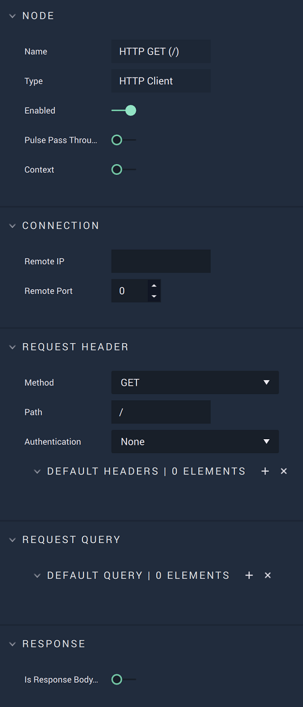

# HTTP Client

## Overview

The **HTTP Client Node** has two `Methods` of use. These are **HTTP GET** and **HTTP POST**.

[**Scope**](../overview.md#scopes):
*  **Project**, **Scene**, **Function**, **Prefab**

## HTTP GET

**HTTP GET** creates a request and returns the response within the _HTTP_ protocol. This is very useful when dealing with APIs. A more detailed explanation involving APIs can be found in the **See Also** section.

## Attributes

| Attribute | Type | Description |
| :--- | :--- | :--- |
| `Remote IP` | **User Input** | The _HTTP_ endpoint \(either a URL or IP address\). |
| `Remote Port` | **Int** | The port value. For _HTTP_, the standard is 80 and for *HTTPS*, the standard is 443. |
| `Method` | **Drop-down** | Either **GET** or **POST**, depending on the goal of the user. |
| `Path` | **User Input** | A specific path from the call being referenced in `Remote IP`. Usually, this is the text after the main root URL but before the `?` character. |
| `Authentication` | **Drop-down** | The user selects `Basic` when a username and password are required to access the information, otherwise `None` is chosen. |
| `Default Headers` | **Add Elements** | _HTTP_ headers in the form of key/value pairs. |
| `Request Query` | **Add Elements** | Parameters of the call in the form of key/value pairs. |
| `Response` | **Bool** | The user chooses true or false depending on whether the response body is binary or not. Currently, the **Node** only supports **Strings**. |

## Inputs

| Input | Type | Description |
| :--- | :--- | :--- |
| _Pulse Input_ \(►\) | **Pulse** | A standard **Input Pulse**, to trigger the execution of the **Node**. |
| `Remote IP` | **String** | The _HTTP_ endpoint \(either a URL or IP address\). |
| `Remote Port` | **Int** | The port value. For _HTTP_, the standard is 80 and for *HTTPS*, the standard is 443. |
| `Path` | **String** | A specific path from the call being referenced in `Remote IP`. Usually, this is the text after the main root URL but before the `?` character. |
| `Headers` | **Dictionary** | _HTTP_ headers in the form of key/value pairs. |
| `Query` | **Dictionary** | Parameters of the call in the form of key/value pairs. |

## Outputs

| Output | Type | Description |
| :--- | :--- | :--- |
| _Pulse Output_ \(►\) | **Pulse** | A standard **Output Pulse**, to move onto the next **Node** along the **Logic Branch**, once this **Node** has finished its execution. |
| `OnResponse` \(►\) | **Pulse** | Flows to additional actions when there is a response. |
| `Status Code` | **Int** | A standard status code within the _HTTP_ protocol. For example, 404 is when a page is not found. |
| `Headers` | **Dictionary** | Parameters of the call in the form of key/value pairs. |
| `Body` | **String** | The body of the response, usually including _HTML_ text. |

## HTTP POST

**HTTP POST** sends data, in this case the information from the `Request Body`, to the desired server as per the _HTTP_ protocol. More information on the differences between **POST** and **GET** can be found in the **External Links** section. All **Attributes** and **Inputs** are the same as those for **HTTP GET** except for the addition of the following:

## Attributes

| Attribute | Type | Description |
| :--- | :--- | :--- |
| `Request Body` | **User Input** | The body of the _HTTP_ request. |

## Inputs

| Input | Type | Description |
| :--- | :--- | :--- |
| `Body` | **String** | The body of the _HTTP_ request. |

## See Also

* [**Using APIs to Pull Dynamic Data**](https://docs.incari.com/incari-studio/v/2021.3-unreleased/demo-projects/using-apis-to-pull-dynamic-data#http-get)

## External Links

* [_GET vs POST_](https://www.w3schools.com/tags/ref_httpmethods.asp) on W3Schools.

