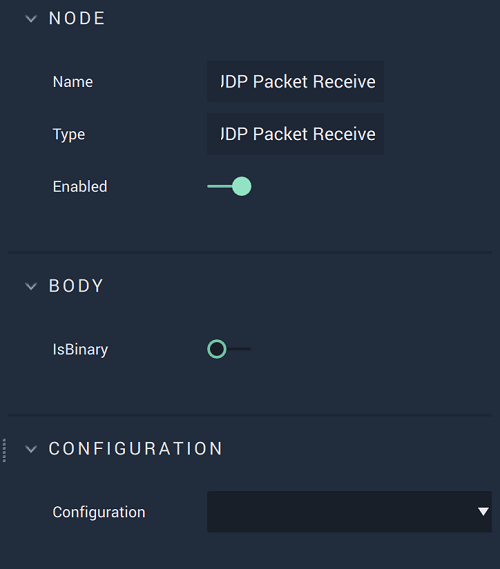

# Overview

**On UDP Packet Receive** is an **Event Listener Node** that listens to an established **UDP** connection and outputs the `Message` data given, therefore enabling the user to trigger a **Logic Branch** when the `Message` is received.

**UDP Communication** in **Incari** is available as a plugin and is enabled as default. However, in the case that it is disabled in the **Plugins Editor**, it will not appear in the **Project Settings** and **On UDP Packet Receive** will not show up in the [**Toolbox**](../../../overview.md). Please refer to the [**Plugins Editor**](../../../../modules/plugins/README.md) to find out more information.

[**Scope**](../../../overview.md#scopes): **Project**, **Scene**.

# Attributes

|Attribute|Type|Description|
|---|---|---|
|`Is Binary`|**Bool**|Can be toggled on or off depending on if the `Message` body is binary or not.|
|`Configuration`|**Drop-Down**|The desired _UDP_ server, which refers back to the selections made under *UDP* in the [**Project Settings**](../../../../modules/project-settings/udp-connection.md).| 

# Outputs

|Output|Type|Description|
|---|---|---|
|*Pulse Output* (►)|**Pulse**|A standard **Output Pulse**, to move onto the next **Node** along the **Logic Branch**, once this **Node** has finished its execution.|
|`Message`|**String**|The returned `Message`.|

