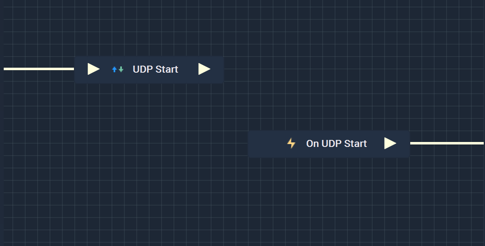
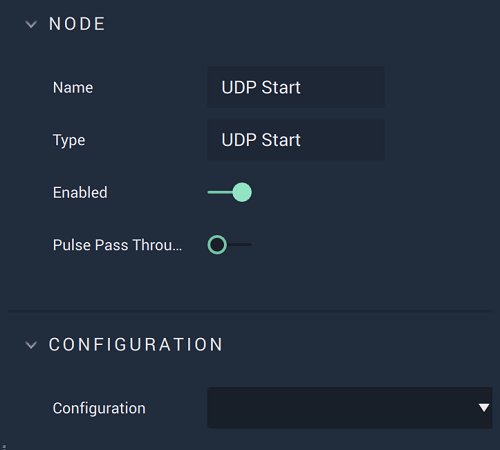

# Overview

**UDP Start** starts a **UDP** connection that has already been set up in [**Project Settings**](../../../modules/project-settings/udp-connection.md).

**UDP Communication** in **Incari** is available as a plugin and is enabled as default. However, in the case that it is disabled in the **Plugins Editor**, it will not appear in the **Project Settings** and **UDP Start** will not show up in the [**Toolbox**](../../overview.md). Please refer to the [**Plugins Editor**](../../../modules/plugins/README.md) to find out more information.

It is important to note that while the **UDP Start Node** starts a **UDP** connection, it may not completely finish establishing
said connection when the **Node** is executed. This could lead to the **Logic** attached to its **Output Pulse** 
to not work even though there is technically nothing wrong. In order to avoid this, it is highly suggested to use 
the [**On UDP Start Node**](events/onudpstart.md) instead. This way, the **Logic** will only execute once the **UDP** connection has definitely been established. 

Again, the user must first use the **UDP Start Node** to open the connection. Separately, the **On UDP Start Node** can be used to execute the desired **Communication Logic**.

[**Scope**](../../overview.md#scopes): **Project**, **Scene**.

# Attributes

|Attribute|Type|Description|
|---|---|---|
|`Configuration`|**Drop-Down**|The desired _UDP_ server, which refers back to the selections made under *UDP* in the [**Project Settings**](../../../modules/project-settings/udp-connection.md).| 

# Inputs

|Input|Type|Description|
|---|---|---|
|*Pulse Input* (►)|**Pulse**|A standard **Input Pulse**, to trigger the execution of the **Node**.|

# Outputs

|Output|Type|Description|
|---|---|---|
|*Pulse Output* (►)|**Pulse**|A standard **Output Pulse**, to move onto the next **Node** along the **Logic Branch**, once this **Node** has finished its execution.|

# See Also

* [**UDP Stop**](udpstop.md)

