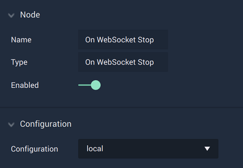

# Overview

The **On WebSocket Stop Node** is an **Event Listener Node** that gives the user a way to perform an action once a **WebSocket** connection has been terminated.

**WebSocket Communication** in **Incari** is available as a plugin and is enabled as default. However, in the case that it is disabled in the **Plugins Editor**, it will not appear in the **Project Settings** and **On WebSocket Stop** will not show up in the [**Toolbox**](../../../overview.md). Please refer to the [**Plugins Editor**](../../../../modules/plugins/README.md) to find out more information.

[**Scope**](../../../overview.md#scopes): **Project**, **Scene**.

# Attributes

|Attribute|Type|Description|
|---|---|---|
|`Configuration`|**Dropdown**|The identifying connection name that will be used, which is one that was set up in the [**Project Settings**](../../../../modules/project-settings/websocket.md).|

# Outputs

|Output|Type|Description|
|---|---|---|
|*Pulse Output* (►)|**Pulse**|A standard **Output Pulse**, to move onto the next **Node** along the **Logic Branch**, once this **Node** has finished its execution.|

# See Also

* [**On WebSocket Start**](onwebsocketstart.md)
* [**On WebSocket Error**](onwebsocketerror.md)
* [**On WebSocket Receive**](onwebsocketreceive.md)

