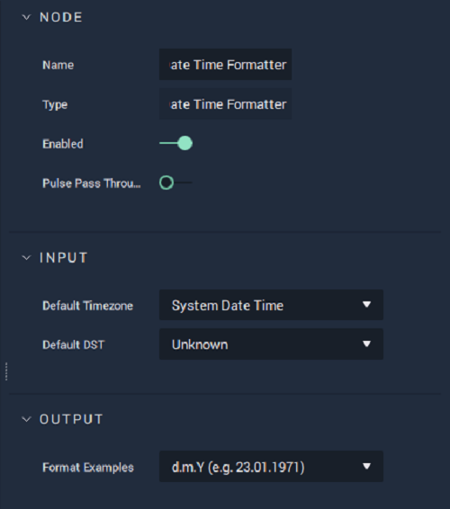

# Date Time Formatter

## Overview

The **Date Time Formatter** **Node** outputs a _date_ and/or _time_ in a specified format. By using a combination of special _format characters_, many different date/time formats can be created. This is used mostly for localization, however, it could also be used for formatting based on user preferences.

For generating customized formats for the _date_ and _time_, _format strings_ are used. For more information about _format strings_, please see the [_format strings_ section](#format-strings) below.

[**Scope**](../overview.md#scopes): **Project**, **Scene**, **Function**, **Prefab**.

## Attributes

### Input

| Attribute | Type | Description |
| :--- | :--- | :--- |
| `Default Timezone` | **Drop-down** | The timezone that will be used, which is an offset of the UTC. |
| `Default DST` | **Drop-down** | Determines whether Daylight Savings Time is taken into account. |

### Output

| Attribute | Type | Description |
| :--- | :--- | :--- |
| `Format Examples` | **Drop-down** | A selection of pre-defined formats. By selecting `Custom`, you can create a custom _formatting string_. |
| `Custom Format` | **String** | The _format string_ which will determine how the date and/or time is represented. |

## Inputs

| Input | Type | Description |
| :--- | :--- | :--- |
| _Pulse Input_ \(►\) | **Pulse** | A standard input **Pulse**, to trigger the execution of the **Node**. |
| `UTC Unix (ms)` | **Int** | The UTC in Unix format. |
| `Timezone Offset (ms)` | **Int** | The time offset in milliseconds. |
| `DST` | **Bool** | Determines whether Daylight Savings Time is taken into account. |
| `Format` | **String** | The _format string_ which will determine how the date and/or time is represented. |

## Outputs

| Output | Type | Description |
| :--- | :--- | :--- |
| _Pulse Output_ \(►\) | **Pulse** | A standard output **Pulse**, to move onto the next **Node** along the **Logic Branch**, once this **Node** has finished its execution. |
| `Output` | **String** | The formatted date/time. |

## Format Strings

_Format strings_ are used for generating customized formats for the _date_ and _time_. To use this, the `Custom` option has to be chosen in the `Format Examples` **Attribute** and then the _format string_ is either given in the `Custom Format` **Attribute** or in the `Format` **Input Socket**.

This section shows first an example of a customized _format string_ and its corresponding output, and then it gives a list of the _format characters_, which are the characters that compose a _format string_.

### Example

Setting the _format string_

    h:m:s a, F j, Y.

will generate an output that looks like:

    01:09:58 pm, September 14, 2022.

### Format characters

_Format characters_ are the characters that compose a _format string_. The following table shows the most important _format characters_:

| _Format character_    | Description | Example     |
| :---        |    :----:   |          ---: |
| d     | Day of the month, including leading zeros     | 01-31   |
| j   | Day of the month, no leading zeros        | 1-31     |
| l   | Day of the week, full name          | Monday-Sunday     |
| D   | Day of the week, three letter name         | Mon-Sun      |
| m   | Month number, including leading zeros         | 01-12      |
| n  | Month number, no leading zeros         | 1-12     |
| F  | Month, full name         |  January-December    |
| M   | Month, three letter name          | Jan-Dec     |
| Y   | Year, four digits         | 1967, 2005     |
| y   | Year, last two digits         | 67, 05     |
| a   | _Meridiem_ indicator, in lowercase         |  am, pm    | 
| A   |  _Meridiem_ indicator, in uppercase        |  AM, PM    |
| g  | Hour in 12-hour format, no leading zeros   | 1-12 |
| h   | Hour in 12-hour format, including leading zeros   | 01-12  |
| G  | Hour in 24-hour format, no leading zeros  | 0-23 |
| H  | Hour in 24-hour format, including leading zeros  | 00-23  |
| i | Minutes  | 00-59  |
| s  | Seconds  | 00-59 |
| T  | Timezone abbreviation  | EST, MDT  |
| c  | ISO 8601 standard  | 2022-09-14T10:09:34-03:00  |
| r  | RFC 2822 standard  | Wed, 14 Sep 2022 10:10:07 -0300 |

## See Also

* [**DateTime**](./)
* [**Timezone Value**](timezone-value.md)
* [**Now \(UTC\)**](https://docs.incari.com/incari-studio/toolbox/datetime/now-utc)

## External Links

* [_Formatting Date and Time_](https://wordpress.org/support/article/formatting-date-and-time/) on WordPress.org.
* [_PHP: date - Manual_](https://www.php.net/manual/en/function.date.php) on PHP.net.
* [_UTC - The World's Time Standard_](https://www.timeanddate.com/time/aboututc.html) on timeanddate.com.