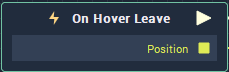

# Overview

**On Hover Leave** is triggered when a mouse cursor is moved away from an **Object**. The **Node** returns the absolute position in the **Screen** the mouse cursor leaves the **Object**.

# Attributes

|Attribute|Type|Description|
|---|---|---|
|`Object`|**ObjectID**|Moving the mouse cursor away from this **Object** will trigger the **On Hover Leave** **Node**.|

# Inputs

|Input|Type|Description|
|---|---|---|
|*Pulse Input* (►)|**Pulse**|A standard **Input Pulse**, to trigger the execution of the **Node**.|

# Outputs

|Output|Type|Description|
|---|---|---|
|*Pulse Output* (►)|**Pulse**|A standard **Output Pulse**, to move onto the next **Node** along the **Logic Branch**, once this **Node** has finished its execution.|
|`Position`|**Vector2**|Returns the absolute `Position` of the mouse cursor at the point it leaves the **Object**. |

# See Also
[**On Hover Enter**](on-hover-enter.md)

[**On Mouse Move**](on-mouse-move.md)

