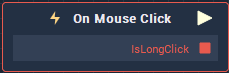

# Overview

**On Mouse Click** node is triggered when you click on the **Object** supplied to the **Attribute**'s **Object** section.

# Attributes

## Object
|Attribute|Type|Description|
|---|---|---|
|`Object`|**ObjectID**|Clicking on this **Object** will trigger the **On Mouse Click Node**.|

## Button
|Attribute|Type|Description|
|---|---|---|
|`Mouse Button`|**Drop-down**|The specific `Mouse Button` Left/ Middle/Right) you wish to click, in order to trigger the **On Mouse Click Node**. |

# Outputs

|Output|Type|Description|
|---|---|---|
|*Pulse Output* (►)|**Pulse**|A standard **Output Pulse**, to move onto the next **Node** along the **Logic Branch**, once this **Node** has finished its execution.|
|`IsLongClick`|**Bool**|Returns **Boolean** value `True` if the mouse button is not immediately released once it's pressed down. |

# See Also
[**On Mouse Button Up**](on-mouse-button-up.md)

[**On Mouse Button Down**](on-mouse-button-down.md)

