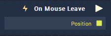

# Overview

**On Mouse Leave** **Node** is triggered when a mouse cursor leaves an **Object** supplied to the **Attributes**'s **Object** section. The **Node** returns the absolute **Screen** position of the mouse cursor at the point where the cursor leaves the **Object**.

# Attributes
## Object
|Attribute|Type|Description|
|---|---|---|
|`Object`|**ObjectID**|Moving the mouse cursor away from this **Object** will trigger the **On Mouse Leave** **Node**.|

# Inputs

|Input|Type|Description|
|---|---|---|
|*Pulse Input* (►)|**Pulse**|A standard **Input Pulse**, to trigger the execution of the **Node**.|

# Outputs

|Output|Type|Description|
|---|---|---|
|*Pulse Output* (►)|**Pulse**|A standard **Output Pulse**, to move onto the next **Node** along the **Logic Branch**, once this **Node** has finished its execution.|
|`Position`|**Vector2**|Returns the absolute `Position` of the mouse cursor on the **Screen** at the point where it leaves the **Object**. |

# See Also
[**On Mouse Button Up**](on-mouse-button-up.md)

[**On Mouse Double Click**](on-mouse-double-click.md)

[**On Mouse Enter**](on-mouse-enter.md)

