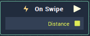

# Overview

**On Swipe** **Node** is triggered when a swipe event is applied to an **Object** supplied to the **Attributes**'s **Object** section. The **Node** returns the `Distance` the swipe event is applied to the **Object**.

# Attributes
## Object
|Attribute|Type|Description|
|---|---|---|
|`Object`|**ObjectID**|Swiping over this **Object** will trigger the **On Swipe** **Node**.|

## Button
|Attribute|Type|Description|
|---|---|---|
|`Mouse Button`|**Drop-down**|The mouse button you would like to utilize for swiping.|

## Swipe
|Attribute|Type|Description|
|---|---|---|
|`Swipe Direction`|**Drop-down**|The direction on the **Object** you wish to swipe.|

# Inputs

|Input|Type|Description|
|---|---|---|
|*Pulse Input* (►)|**Pulse**|A standard **Input Pulse**, to trigger the execution of the **Node**.|

# Outputs

|Output|Type|Description|
|---|---|---|
|*Pulse Output* (►)|**Pulse**|A standard **Output Pulse**, to move onto the next **Node** along the **Logic Branch**, once this **Node** has finished its execution.|
|`Distance`|**Vector2**|Returns the swipe distance applied to the **Object** in the x and y directions. |

# See Also
[**On Mouse Button Up**](on-mouse-button-up.md)

[**On Mouse Enter**](on-mouse-enter.md)

