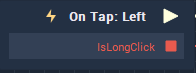

# Overview

**On Tap** **Node** is triggered when an **Object** supplied to the **Attributes**'s **Object** section is tapped with the mouse button.

# Attributes

|Attribute|Type|Description|
|---|---|---|
|`Object`|**ObjectID**|Tapping over this **Object** will trigger the **On Tap** **Node**.|

# Inputs

|Input|Type|Description|
|---|---|---|
|*Pulse Input* (►)|**Pulse**|A standard **Input Pulse**, to trigger the execution of the **Node**.|

# Outputs

|Output|Type|Description|
|---|---|---|
|*Pulse Output* (►)|**Pulse**|A standard **Output Pulse**, to move onto the next **Node** along the **Logic Branch**, once this **Node** has finished its execution.|
|`IsLongClick`|**Bool**|Returns **Boolean** value `True` if the mouse button is not immediately released once it's tapped otherwise `False`. |

# See Also
[**On Mouse Button Up**](on-mouse-button-up.md)

[**On Mouse Enter**](on-mouse-enter.md)

[**On Swipe**](on-swipe.md)

