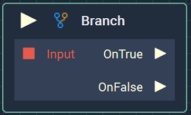
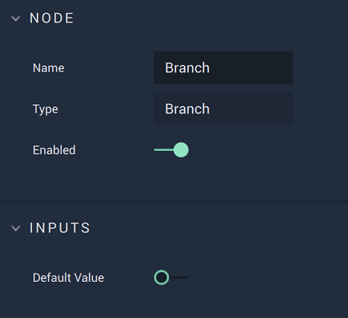

# Branch

## Overview

**Branch** triggers one of two **Pulses**, based on whether or not the `Input` value is _true_ or _false_. Branching is a fundamental part of _conditional logic_ and at a high level it basically means "_If this is true, do this; if not, do that_". Although the **Node** takes a single condition, this condition can be composed of multiple other conditions when used in conjunction with _**Relational Expression**_ **Nodes** \([**Is Equal**](is-equal.md), [**Is Greater Equal**](is-greater-equal.md), and [**Is Less Equal**](is-less-equal.md)\), _**Logical Operator**_ **Nodes** \([**AND**](../math/boolean/and.md), [**OR**](../math/boolean/or.md), and [**Negate**](../math/boolean/negate.md)\), and other **Branch Nodes**.

[**Scope**](../overview.md#scopes): **Project**, **Scene**, **Function**, **Prefab**.

## Attributes

### Inputs

| Attribute | Type | Description |
| :--- | :--- | :--- |
| `Default Value` | **Bool** | The default value, if one is not provided in the `Input` **Socket.** |

## Inputs

| Input | Type | Description |
| :--- | :--- | :--- |
| _Pulse Input_ \(►\) | **Pulse** | A standard input **Pulse**, to trigger the execution of the **Node**. |
| `Input` | **Bool** | The _true_ or _false_ condition to determine which of the two output **Pulses** is executed. |

## Outputs

| Output | Type | Description |
| :--- | :--- | :--- |
| `OnTrue` \(►\) | **Pulse** | The **Pulse** that will be triggered if `Input` is _true_. |
| `OnFalse` \(►\) | **Pulse** | The **Pulse** that will be triggered if `Input` is _false_. |

## External Links

* [_Conditional \(computer programming\)_](https://en.wikipedia.org/wiki/Conditional_%28computer_programming%29) on Wikipedia.

