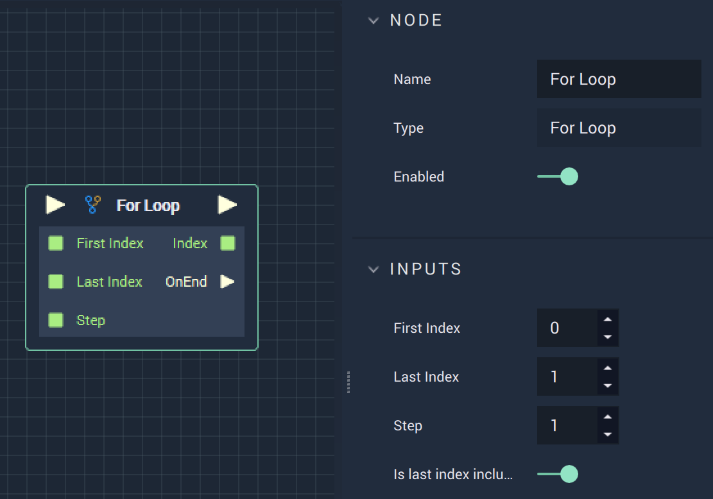

# For Loop
# Overview

The **For Loop Node** triggers an iterative process that steps through the provided **Integer** inputs. The output can then, for example, be printed to the **Console** or influence the next **Node** in the **Logic Branch**. 

# Attributes

|Attribute|Type|Description|
|---|---|---|
|`First Index`|**Int**|The starting index.|
|`Last Index`|**Int**|The stopping index.|
|`Step`|**Int**|The amount to increase or decrease by.|
|`Is Last Index Included`|**Bool**|Notes whether the last index is included or excluded during the iteration.|

# Inputs

|Input|Type|Description|
|---|---|---|
|*Pulse Input* (►)|**Pulse**|A standard **Input Pulse**, to trigger the execution of the **Node**.|
|`First Index`|**Int**|The starting index.|
|`Last Index`|**Int**|The stopping index.|
|`Step`|**Int**|The amount to increase or decrease by.|

# Outputs

|Output|Type|Description|
|---|---|---|
|*Pulse Output* (►)|**Pulse**|A standard **Output Pulse**, to move onto the next **Node** along the **Logic Branch**, once this **Node** has finished its execution.|
|`Index`|**Int**|The index to be outputted.|
|`On End`(►)|**Pulse**|A **Pulse** that flows to an action, such as a **Console** message, in the event that the **For Loop** has ended.|

# See Also

* [For Each Loop](foreachloop.md)

# External Links

* [For loop explanation](https://en.wikipedia.org/wiki/For_loop) on Wikipedia.
