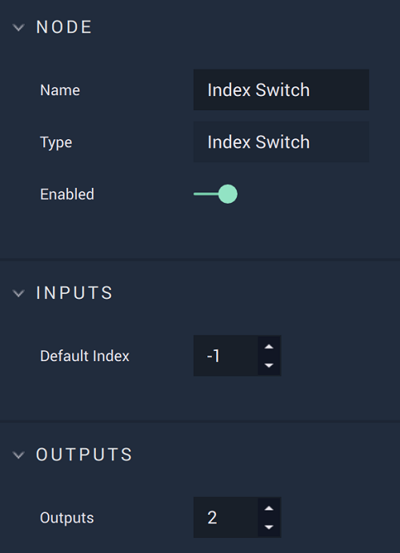

# Index Switch

## Overview

The **Index Switch Node** takes an **Int** as input and compares it to the value of`Index: value`, returning *true* or *false*. This could be used, for example, for enabling or disabling features in a *User Interface* based on the output of a function.

[**Scope**](../overview.md#scopes): **Project**, **Scene**, **Function**, **Prefab**.

## Attributes

| Attribute | Type | Description |
| :--- | :--- | :--- |
| `Default Index` | **Drop-down** | The **Index** that corresponds to `Default`. |
| `Outputs` | **Drop-down** | The number of **Index** outputs. In the sample image there are two `Outputs`, which correspond to `Index: 0` and `Index: 1` on the **Node**. |

## Inputs

| Input | Type | Description |
| :--- | :--- | :--- |
| _Pulse Input_ \(►\) | **Pulse** | A standard **Input Pulse**, to trigger the execution of the **Node**. |
| `Index` | **Int** | The **Integer** to be compared. |

## Outputs

| Output | Type | Description |
| :--- | :--- | :--- |
| _Pulse Output_ \(►\) | **Pulse** | A standard **Output Pulse**, to move onto the next **Node** along the **Logic Branch**, once this **Node** has finished its execution. |
| `Index: [n]` | **Bool** | The **Index** that is being compared to the **Integer** **Input**. |
| `Default` | **Bool** | The default **Index** which is set in **Inputs**. |

## See Also

* [**Switch**](switch.md)

