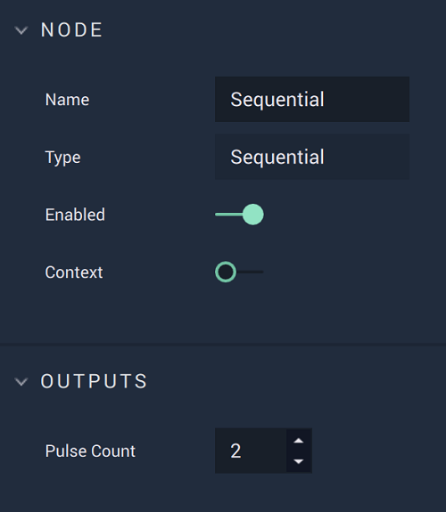
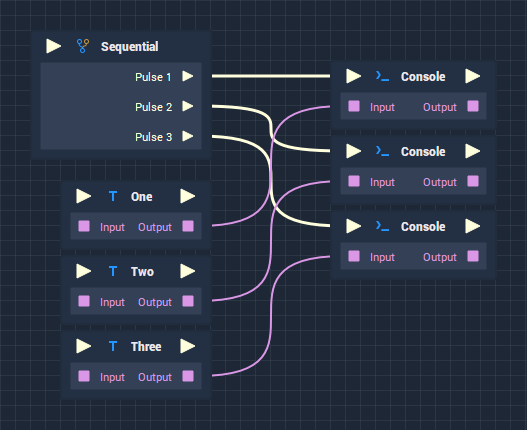
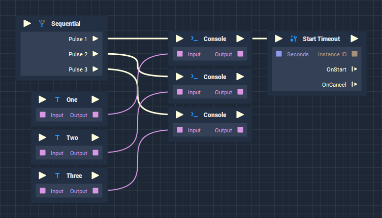
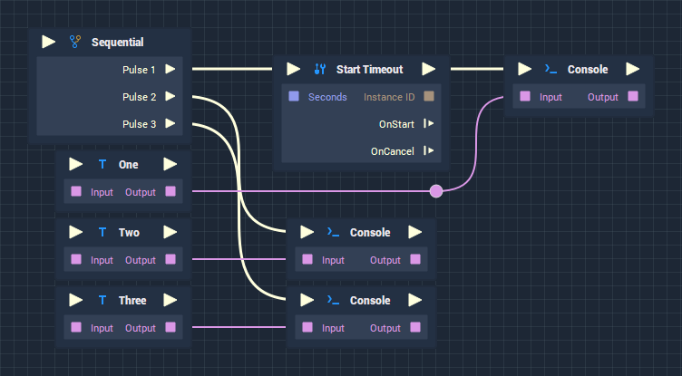

# Sequential

## Overview


The **Sequential Node** generates a user-defined number of **Output Pulses**, and executes their **Logic** sequentially \(one after the other\), with the top-most **Pulses** being executed first. The one caveat to this is that if any **Nodes** that pause or delay the flow of **Logic** are used, they will only affect that particular **Branch**, not the other **Output Pulses** \(See **Execution Order** below\).

They are used primarily as a means of grouping and organizing blocks of **Logic** with a similar or combined purpose into a more visually readable way.

*Scope*: **Project**, **Scene**, **Function**, **Prefab**

## Attributes



### Outputs

| Attribute | Type | Description |
| :--- | :--- | :--- |
| `Pulse Count` | **Int** | The number of **Output Pulses** that will be executed in the sequence. |

## Inputs

| Input | Type | Description |
| :--- | :--- | :--- |
| _Pulse Input_ \(►\) | **Pulse** | A standard input **Pulse**, to trigger the execution of the **Node**. |

## Outputs

| Output | Type | Description |
| :--- | :--- | :--- |
| `Pulse [n]` | **Pulse** | A **Pulse** which is executed sequentially from top-to-bottom. The total number of **Pulses** is defined in the `Pulse Count` **Attribute**. |

## Execution Order

### Example 1



Here, we output three written numbers to the console, using the **Sequential Node**. As one might expect, the numbers are shown immediately after one another, in the correct order:

```text
One   [0 seconds]
Two   [0 seconds]
Three [0 seconds]
```

### Example 2



When we add a **Start Timeout Node**, which delays the execution of **Branch**, one might expect the numbers to be output in order, with a delay between "One" and "Two". This, however, is not the case, as **Timeout Nodes** only affect the **Branch** that they are on. You will instead see the following output, exactly as before:

```text
One   [0 seconds]
Two   [0 seconds]
Three [0 seconds]
```

### Example 3



This becomes much clearer, when we insert a **Start Timeout Node** _before_ the **Console Node** is executed. Now we see that "Two" and "Three" are shown immediately, whereas "One" is output to the console after the given time has elapsed.

```text
Two   [0 seconds]
Three [0 seconds]
One   [1 second]
```

