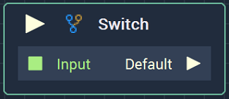

# Switch

## Overview

**Switch** takes an input value and triggers one of several output **Pulses**, based on whether or not the input matches a pre-defined value. These pre-defined values, referred to as _cases_ in computer programming, can be defined as a list in the `Cases` **Attribute**. Each value added to the **Node** also creates a corresponding output **Pulse**. If the value of the `Input` **Socket** matches a value defined in the `Cases` **Attribute**, its corresponding **Pulse** is triggered. If no match is found, then the `Default` **Pulse** is triggered instead.

[**Scope**](../overview.md#scopes):
*  **Project**, **Scene**, **Function**, **Prefab**

## Attributes

### Inputs

| Attribute | Type | Description |
| :--- | :--- | :--- |
| `Data Type` | **Drop-down** | The type of data that will be plugged into the `Input` **Socket**. |

### Outputs

| Attribute | Type | Description |
| :--- | :--- | :--- |
| `Cases [n]` | _Defined in the `Data Type` **Attribute**._ | The pre-defined values, which will be compared to the value of the `Input` **Socket**. |

## Inputs

| Input | Type | Description |
| :--- | :--- | :--- |
| _Pulse Input_ \(►\) | **Pulse** | A standard input **Pulse**, to trigger the execution of the **Node**. |
| `Input` | _Defined in the `Data Type` **Attribute**._ | The value to be compared with the list of pre-defined `Cases`. |

## Outputs

| Output | Type | Description |
| :--- | :--- | :--- |
| `Case: [n]` | **Pulse** | An **Output Pulse** for each pre-defined _case_, whose execution is triggered if the corresponding value is evaluated as being equal to `Input`. |

## External Links

* [_Switch statement_](https://en.wikipedia.org/wiki/Switch_statement) on Wikipedia.

