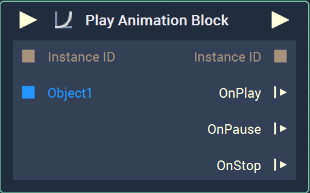
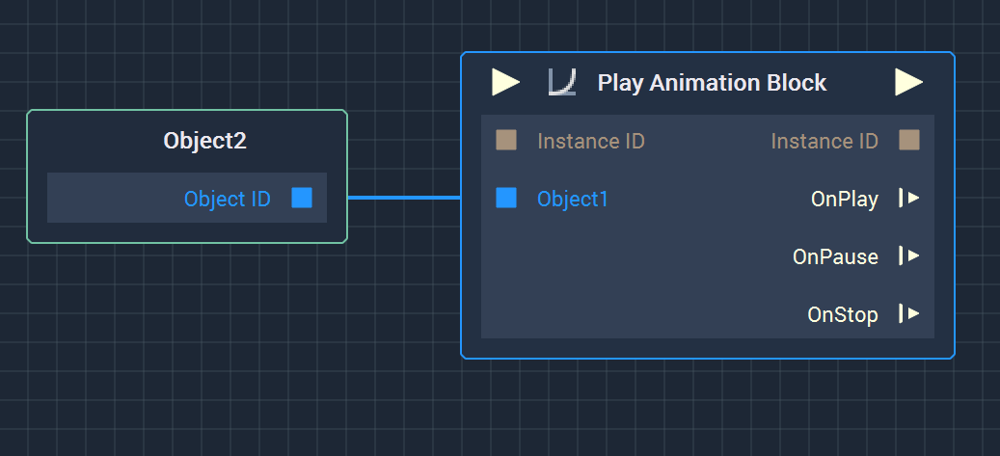

# Play Animation

## Overview

<!--  -->

**Play Animation** is an **Animation** **Node** used to start playing an **Animation**. The **Animation** to play has to be selected in the **Attributes**. For this, simply drag an **Animation** `.incani` file from the **Asset Manager** to the `File` **Attribute** and then a drop-down Menu that allows the user to choose an **Animation Block** will appear.

When an **Animation** starts playing, an [**Instance ID**](README.md#instance-id) gets assigned to it, which is then used to control the **Animation** with the [**Pause Animation**](pauseanimation.md) or [**Stop Animation**](stopanimation.md) **Nodes**. This [**Instance ID**](README.md#instance-id) can be set with the [**Create CustomID Node**](../../utilities/createcustomid.md) connected to the `Instance ID` **Input Socket**. If nothing is connected, the default value 42 is used.

It is also possible to [reuse an **Animation** with a different **Object**](#reusing-an-animation).

[**Scope**](../../overview.md#scopes): **Scene**, **Function**, **Prefab**.

### Attributes

| Attribute | Type | Description |
| :--- | :--- | :--- |
| `File` | **User Input** | The selected **Animation** file created in the [**Animation Editor**](../../../modules/animation-editor.md). The user can drag a file from their library or select a file from a file tree. The icons to the right allow the user to confirm the selection, highlight the **Asset** in the **Asset Manager**, and remove the selection. |
| `Name` | **Drop-down** | The specified **Animation Block** created in the **Animation Editor** that will be played. <!-- In the sample image, it is labeled **Animation Block**, but it is useful to name it in relation to the animation purpose. --> |

### Inputs

| Input | Type | Description |
| :--- | :--- | :--- |
| _Pulse Input_ \(►\) | **Pulse** | A standard **Input Pulse**, to trigger the execution of the **Node**. |
| `Instance ID` | **InstanceID** | The assigned [**Instance ID**](README.md#instance-id) of the **Animation**. |

### Outputs

| Output | Type | Description |
| :--- | :--- | :--- |
| _Pulse Output_ \(►\) | **Pulse** | A standard **Output Pulse**, to move onto the next **Node** along the **Logic Branch**, once this **Node** has finished its execution. |
| `Instance ID` | **InstanceID** | The previously assigned [**Instance ID**](README.md#instance-id) of the **Animation**. |
| `OnPlay` | **Pulse** | Flows to additional **Nodes** following **Play Animation** when the **Animation** starts playing. |
| `OnPause` | **Pulse** | Flows to additional **Nodes** following **Play Animation** if the **Animation** pauses. |
| `OnStop` | **Pulse** | Flows to additional **Nodes** following **Play Animation** if the **Animation** stops. |

### Reusing an Animation

Using the **Play Animation Node**, it is possible to reuse an **Animation** for a different **Object** than the one used in the `.incani` file. For this, the **ObjectID** **Input Sockets** must be used.

When an **Animation Block** is assigned to the **Play Animation Node** in the **Attributes**, new **ObjectID** **Input Sockets** are created, one for each **Object** in the **Animation Block**. These **Input Socket** can be used to animate a different **Object**.

Thus, a **Play Animation** **Node** with an **Object** connected to the **ObjectID** **Sockets** will animate that **Object** instead of the one defined in the **Animation Block**. In the example below, `Object2` will be animated instead of `Object1`, which was the **Object** originally used in the **Animation**.

<!-- The behavior of the **Animation** as it plays may change depending on the **Attribute** being animated, and whether it is stopped or paused. For `Position` and `Rotation`, the **Animation** will continue at the state it was paused but start at the beginning when played again. For `Scale` and `Opacity`,   -->

## See Also

* [**Pause Animation**](pauseanimation.md)
* [**Stop Animation**](stopanimation.md)

