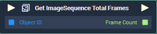

# Overview

**Get ImageSequence Total Frames** returns the total number of frames (*Frame Count*) found in the **Image Sequence** **Object**.

# Attributes
## Object

|Attribute|Type|Description|
|---|---|---|
|`Object`|**ObjectID**|The **ImageSequence** **Object** whose `Frame Count` you wish to return, if one is not provided in the `Object ID` **Input** **Socket**.|

# Inputs

|Input|Type|Description|
|---|---|---|
|*Pulse Input* (►)|**Pulse**|A standard **Input Pulse**, to trigger the execution of the **Node**.|
|`Object ID`|**ObjectID**|The **ImageSequence** **Object** whose `Frame Count` you wish to return.|

# Outputs

|Output|Type|Description|
|---|---|---|
|*Pulse Output* (►)|**Pulse**|A standard **Output Pulse**, to move onto the next **Node** along the **Logic Branch**, once this **Node** has finished its execution.|
|`Frame Count`|**Int**|The number of frames in an **ImageSequence** **Object**.|

# See Also
[**Get ImageSequence FPS**](get-imagesequence-fps.md)

[**Get ImageSequence Duration**](get-imagesequence-duration.md)

