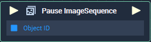

# Overview

The **Node** pauses a playing **ImageSequence** **Node**.

# Attributes
## Object

|Attribute|Type|Description|
|---|---|---|
|`Object`|**ObjectID**|The playing **ImageSequence** **Object** you wish to pause, if one is not provided in the `Object ID` **Input** **Socket**.|

# Inputs

|Input|Type|Description|
|---|---|---|
|*Pulse Input* (►)|**Pulse**|A standard **Input Pulse**, to trigger the execution of the **Node**.|
|`Object ID`|**ObjectID**|The playing **ImageSequence** **Object** you wish to pause.

# Outputs

|Output|Type|Description|
|---|---|---|
|*Pulse Output* (►)|**Pulse**|A standard **Output Pulse**, to move onto the next **Node** along the **Logic Branch**, once this **Node** has finished its execution.|

# See Also
[**Play ImageSequence**](play-imagesequence.md)

[**Stop ImageSequence**](stop-imagesequence.md)

