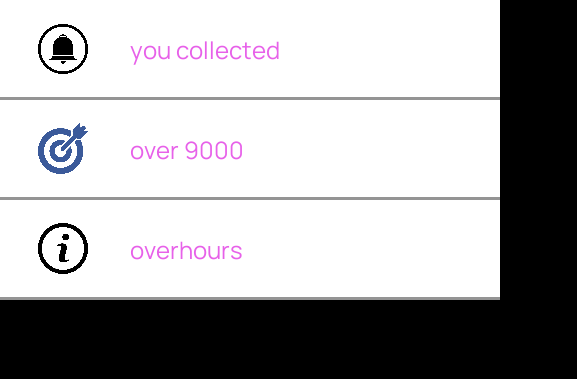

# Overview


The **Set List Data Node** allows the user to set the data of a [**List**](../../../objects-and-types/scene2d-objects/gui/list.md) in a **Scene2D**. 

This **Node** requires that the *JSON* data is in **Array** format. Refer to the [example](setlistdata.md#example) at the bottom of the page.


[**Scope**](../../overview.md#scopes): **Scene**, **Function**, **Prefab**.


# Inputs

|Input|Type|Description|
|---|---|---|
|*Pulse Input* (►)|**Pulse**|A standard **Input Pulse**, to trigger the execution of the **Node**.|
|`Object ID`|**ObjectID**|The **List** that the user wishes to set the data for.|
|`List Data`|**Array**|The *JSON* list data in **Array** format.|

# Outputs

|Output|Type|Description|
|---|---|---|
|*Pulse Output* (►)|**Pulse**|A standard **Output Pulse**, to move onto the next **Node** along the **Logic Branch**, once this **Node** has finished its execution.|


# Example 

For correct formatting, start with the desired *JSON* file. Here we have an example:

```
   [
    {
        "icon": "Users/user.name/Documents/Project1/Assets/image1.jpg",
        "text": "you collected"
    },
    {
        "icon": "Users/user.name/Documents/Project1/Assets/image2.png",
        "text": "over 9000"
    },
    {
        "icon": "Users/user.name/Documents/Project1/Assets/image3.png",
        "text": "overhours"
    }
]
```

This needs to be placed into an **Array**. Go into the **Logic Editor** and populate an **Array** with the elements of the desired *JSON* using your preferred method. 

The full **Array** would look like this if outputted to the **Console**:

```
[ { icon:Users/user.name/Documents/Project1/Assets/image1.jpg, text:you collected }, { icon:Users/user.name/Documents/Project1/Assets/image2.png, text:over 9000 }, { icon:Users/user.name/Documents/Project1/Assets/image3.png, text:overhours } ]
```


<!--To best visualize the structure of each element, the above image shows a manual implementation. Of course for longer *JSON* files, this would be very inefficient and using this **Node** in tandem with the [**For Loop Node**](../../flow-control/forloop.md) might be useful.--> 

Each element is encapsulated by `{}` symbols, like in the *JSON*. The `""` are not necessary here. Simply use an A:B format with a comma separating the lines of each element. 

The resulting **List** should look like this in the **Player**:




# See Also

* [**Get List Data**](getlistdata.md)