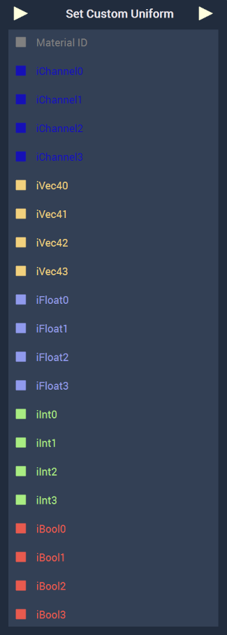
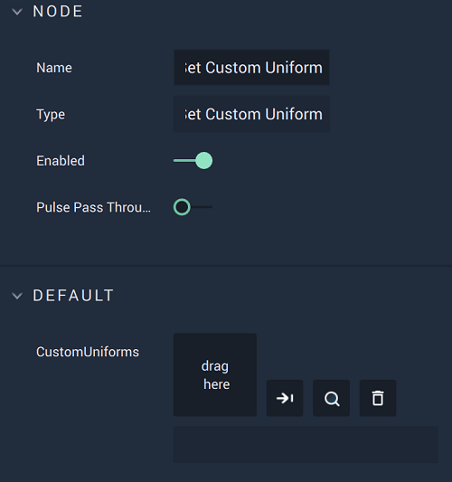

# Overview

The **Set Custom Uniform Node** allows the user to set values for a **Custom Material's** `Uniforms` **Attributes**, which are found specifically in the [**Custom Shading Model**](../../../modules/material-editor/customshadingmodel.md).

[**Scope**](../../overview.md#scopes): **Scene**, **Function**, **Prefab**

# Attributes

|Attribute|Type|Description|
|---|---|---|
|`CustomUniforms`|**MaterialID**|The **Material** whose `Uniforms` will be set, if one is not attached in the **Input Socket**.|

# Inputs

|Input|Type|Description|
|---|---|---|
|*Pulse Input* (►)|**Pulse**|A standard **Input Pulse**, to trigger the execution of the **Node**.|
|`Material ID`|**MaterialID**|The **Material** whose `Uniforms` will be set.|
|`iChannelx`|**TextureID**|A *texture map* to set as a `Uniform`. The *x* refers to the identifying integer in the name, which can be 0, 1, 2, and 3.|
|`iVec4x`|**Vector4**|A **Vector4** to set as a `Uniform`. The *x* refers to the identifying integer in the name, which can be 0, 1, 2, and 3.|
|`iFloatx`|**Float**|A **Float** to set as a `Uniform`. The *x* refers to the identifying integer in the name, which can be 0, 1, 2, and 3.|
|`iIntx`|**Int**|An **Int** to set as a `Uniform`. The *x* refers to the identifying integer in the name, which can be 0, 1, 2, and 3.|
|`iBoolx`|**Bool**|A **Bool** to set as a `Uniform`. The *x* refers to the identifying integer in the name, which can be 0, 1, 2, and 3.|

# Outputs

|Output|Type|Description|
|---|---|---|
|*Pulse Output* (►)|**Pulse**|A standard **Output Pulse**, to move onto the next **Node** along the **Logic Branch**, once this **Node** has finished its execution.|

