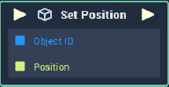

# Overview

**Set Position** sets the value of a given **Object**'s `Position` **Attribute**.

# Attributes

|Attribute|Type|Description|
|---|---|---|
|`Object`|**ObjectID**|The ID of the **Object** that you would like to set the `Position` value of if one is not provided in the `Object ID` **Socket**.|
|`Default Position`|**Vector3**|The default value of the `Position` **Socket**, if no value is provided.|

# Inputs

|Input|Type|Description|
|---|---|---|
|*Pulse Input* (►)|**Pulse**|A standard **Input Pulse**, to trigger the execution of the **Node**.|
|`Object`|**ObjectID**|The ID of the **Object** that you would like to set the `Position` value of.|
|`Position`|**Vector3**|The `Position` you would like to set for the **Object** in a **Scene**.|

# Outputs

|Output|Type|Description|
|---|---|---|
|*Pulse Output* (►)|**Pulse**|A standard **Output Pulse**, to move onto the next **Node** along the **Logic Branch**, once this **Node** has finished its execution.|

# See Also
- [**Get Rotation**](get-rotation.md)
- [**Get Scale**](get-scale.md)
- [**Get Position**](get-position.md)

# External Links
- [*Positioning*](https://en.wikipedia.org/wiki/Position_(geometry)) in geometry.
