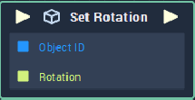

# Set Rotation

## Overview

**Set Rotation** sets the value of a given **Object**'s `Rotation` **Attribute**.

## Attributes

| Attribute | Type | Description |
| :--- | :--- | :--- |
| `Object` | **ObjectID** | The ID of the **Object** that you would like to set the `Rotation` value of if one is not provided in the `Object ID` **Socket**. |
| `Rotation` | **Vector3** | The desired `Rotation` value of the **Object** if one is not provided in the `Rotation` **Socket**. |

## Inputs

| Input | Type | Description |
| :--- | :--- | :--- |
| _Pulse Input_ \(►\) | **Pulse** | A standard **Input Pulse**, to trigger the execution of the **Node**. |
| `Object ID` | **ObjectID** | The ID of the **Object** that you would like to set the `Rotation` value of. |
| `Rotation` | **Vector3** | The desired `Rotation` value of the **Object**. |

## Outputs

| Output | Type | Description |
| :--- | :--- | :--- |
| _Pulse Output_ \(►\) | **Pulse** | A standard **Output Pulse**, to move onto the next **Node** along the **Logic Branch**, once this **Node** has finished its execution. |

## See Also

* [**Get Scale**](get-scale.md)
* [**Get Position**](get-position.md)
* [**Get Rotation**](get-position.md)

## External Links

* [_Rotation_](https://en.wikipedia.org/wiki/Euler_angles) on wikipedia.

