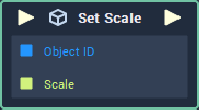

# Overview

**Set Scale** sets the `Scale` of an **Object** in a **Scene**.

# Attributes

|Attribute|Type|Description|
|---|---|---|
|`Object`|**ObjectID**|The **Object** that you wish to *set scale* of, if one is not provided in the `object ID` **Socket**.|
|`Default Scale`|**Vector3**|The default value of the `Scale` **Socket**, if no value is provided.|

# Inputs

|Input|Type|Description|
|---|---|---|
|*Pulse Input* (►)|**Pulse**|A standard **Input Pulse**, to trigger the execution of the **Node**.|
|`Object`|**ObjectID**|The ID of the **Object** you would like to `Set` a  `Scale` value.|
|`Scale`|**Vector3**|The input `Scale` of the **Object**.|

# Outputs

|Output|Type|Description|
|---|---|---|
|*Pulse Output* (►)|**Pulse**|A standard **Output Pulse**, to move onto the next **Node** along the **Logic Branch**, once this **Node** has finished its execution.|

# See Also
- [**Get Scale**](get-scale.md)

# External Links
- [*Scaling*](https://en.wikipedia.org/wiki/Scaling_(geometry)) in geometry.
