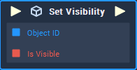

# Overview

**Set Visibility** makes an **Object** either visible or not visible in a **Scene**.

# Attributes

|Attribute|Type|Description|
|---|---|---|
|`Object`|**ObjectID**|The **Object** that you wish to *set visibility* of, if one is not provided in the `object ID` **Socket**.|
|`Is Visible`|**Bool**|A boolean indicating whether a desired **Object** is set to *visible* or not. The default value is `true`.|

# Inputs

|Input|Type|Description|
|---|---|---|
|*Pulse Input* (►)|**Pulse**|A standard **Input Pulse**, to trigger the execution of the **Node**.|
|`Object`|**ObjectID**|The ID of the **Object** you would like to make *visible* or not.|
|`Is Visible`|**Bool**|An input *boolean* that sets the **Object** **Visibility** to either *true* or *false*.|

# Outputs

|Output|Type|Description|
|---|---|---|
|*Pulse Output* (►)|**Pulse**|A standard **Output Pulse**, to move onto the next **Node** along the **Logic Branch**, once this **Node** has finished its execution.|

# See Also
- [**Get Visibility**](get-visibility.md)

