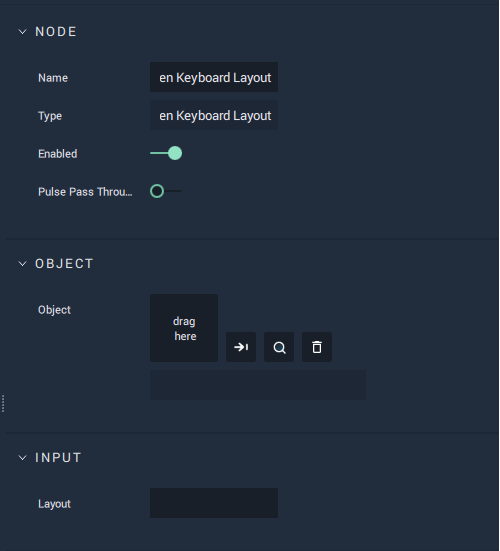

# Overview

The **Set Screen Keyboard Layout** **Node** sets, or changes, the *layout* of an **On-Screen Keyboard**.

The default options are: `English` and `German`. More *layouts* can be added in the [**Project Settings**](../../../modules/project-settings.md#keyboard).

# Attributes

## Object

|Attribute|Type|Description|
|---|---|---|
| `Object` | **ObjectID** | **On-Screen Keyboard** whose *layout* will be set, if none is given in the **Input Socket**. |

## Input

|Attribute|Type|Description|
|---|---|---|
| `Layout` | **String** | *Layout* to be set, if none is given in the **Input Socket**. |

# Inputs

|Input|Type|Description|
|---|---|---|
|*Pulse Input* (►)|**Pulse**|A standard **Input Pulse**, to trigger the execution of the **Node**.|
| `Object ID` | **ObjectID** | **On-Screen Keyboard** whose *layout* will be set. |
| `Layout` | **String** | *Layout* to be set. |

# Outputs

|Output|Type|Description|
|---|---|---|
|*Pulse Output* (►)|**Pulse**|A standard **Output Pulse**, to move onto the next **Node** along the **Logic Branch**, once this **Node** has finished its execution.|

# See Also

* [**Get Screen Keyboard Layout**](getscreenkeyboardlayout.md)
