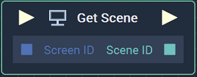

# Overview

The **Get Scene Node** returns the current **Scene** of a chosen **Screen**.

[**Scope**](../overview.md#scopes):
*  **Project**

# Attributes

|Attribute|Type|Description|
|---|---|---|
|`Screen`|**Screen**|The ID of the **Screen** the user wishes to get the current **Scene** from, if none is indicated in the **Input Socket**.|

# Inputs

|Input|Type|Description|
|---|---|---|
|*Pulse Input* (►)|**Pulse**|A standard **Input Pulse**, to trigger the execution of the **Node**.|
|`Screen ID`|**Screen**|The ID of the **Screen** the user wishes to get the current **Scene** from.|

# Outputs

|Output|Type|Description|
|---|---|---|
|*Pulse Output* (►)|**Pulse**|A standard **Output Pulse**, to move onto the next **Node** along the **Logic Branch**, once this **Node** has finished its execution.|
|`Scene ID`|**Scene**|The returned ID of the **Screen's** current **Scene**.|

# See Also

* [**Set Scene**](setscene.md)
