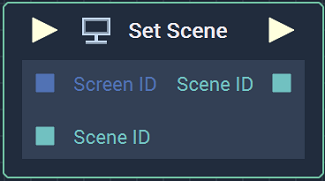

# Overview

The **Set Scene Node** sets the chosen **Scene** for a **Screen**. The user simply needs to choose a **Screen** and any of its **Scenes** (other than the current **Scene**) as inputs. The output will be the ID of the final **Scene**. 

# Attributes

|Attribute|Type|Description|
|---|---|---|
|`Screen`|**Screen**|The ID of the **Screen** the user wishes to set the **Scene** for, if one is not already indicated in the **Input Socket**.|
|`Scene`|**Scene**|The ID of the chosen **Scene**, if one is not already indicated in the **Input Socket**.|

# Inputs

|Input|Type|Description|
|---|---|---|
|*Pulse Input* (►)|**Pulse**|A standard **Input Pulse**, to trigger the execution of the **Node**.|
|`Screen ID`|**Screen**|The ID of the **Screen** the user wishes to se the **Scene** for.|
|`Scene ID`|**Scene**|The ID of the chosen **Scene**.|

# Outputs

|Output|Type|Description|
|---|---|---|
|*Pulse Output* (►)|**Pulse**|A standard **Output Pulse**, to move onto the next **Node** along the **Logic Branch**, once this **Node** has finished its execution.|
|`Scene ID`|**Scene**|The returned **Scene** ID.|

# See Also

* [**Get Scene**](getscene.md)
