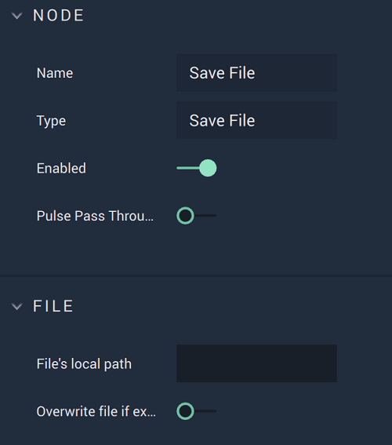

# Save File

## Overview

**Save File** is an _io_ **Node**, which allows one to store a specified file containing relevant data from the current project, such as the value of a variable. Providing a location gives a future point of access for the user, which can then be loaded using **Load File**. When saving a **Dictionary**, **JSON Stringify** must be used. This allows for persistent data between sessions.

[**Scope**](../overview.md#scopes): **Project**, **Scene**, **Function**, **Prefab**.

## Attributes

| Attribute | Type | Description |
| :--- | :--- | :--- |
| `File's Local Path` | **User Input** | The `file path` local to the user's device. |
| `Overwrite File if Exists` | **Bool** | If the `file path` already exists, the current data will replace the data in the existing file. |

## Inputs

| Input | Type | Description |
| :--- | :--- | :--- |
| _Pulse Input_ \(►\) | **Pulse** | A standard **Input Pulse**, to trigger the execution of the **Node**. |
| `Content` | Defined in the **Logic Editor**. | The **Project** content that needs to be saved. |

## Outputs

| Output | Type | Description |
| :--- | :--- | :--- |
| _Pulse Output_ \(►\) | **Pulse** | A standard **Output Pulse**, to move onto the next **Node** along the **Logic Branch**, once this **Node** has finished its execution. |

