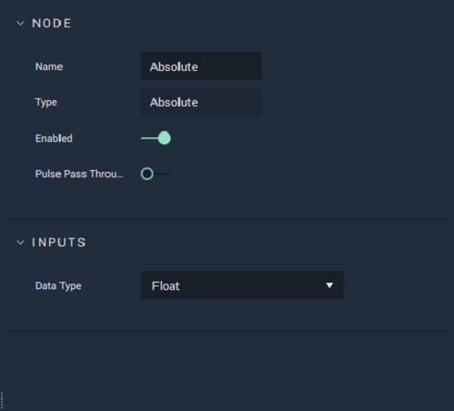

# Absolute

## Overview

**Absolute** takes a single numerical value and converts any negative value \(per component\) to its absolute/non-negative equivalent.

*Scope*: **Project**, **Scene**, **Function**, **Prefab**

## Attributes

| Attribute | Type | Description |
| :--- | :--- | :--- |
| `Data Type` | **Drop-down** | The type of data that will be plugged into the `Input` **Socket** and will return via its `Output` **Socket**. |

## Inputs

| Input | Type | Description |
| :--- | :--- | :--- |
| _Pulse Input_ \(►\) | **Pulse** | A standard input **Pulse**, to trigger the execution of the **Node**. |
| `Input` | _Defined in the `Data Type` **Attribute**_. | The value to be converted to its non-negative equivalent. |

## Outputs

| Output | Type | Description |
| :--- | :--- | :--- |
| _Pulse Output_ \(►\) | **Pulse** | A standard output **Pulse**, to move onto the next **Node** along the **Logic Branch**, once this **Node** has finished its execution. |
| `Output` | _Defined in the `Data Type` **Attribute**_. | The non-negative equivalent of `Input`. |

## External Links

* [_Absolute value_](https://en.wikipedia.org/wiki/Absolute_value) on Wikipedia.

