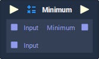

# Overview

**Minimum** compares two or more numerical **Inputs** against each other and returns the lower bound (minimum **Value**) in the set.

# Attributes

|Attribute|Type|Description|
|---|---|---|
|`Data Type`|**Drop-down**|The **Data Type** of all `Input` and `Output` **Sockets**.|
|`Count`|**Int**|The number of **Data Input Sockets** the **Node** will have.|

# Inputs

|Input|Type|Description|
|---|---|---|
|*Pulse Input* (►)|**Pulse**|A standard **Input Pulse**, to trigger the execution of the **Node**.|
|`Input [n]`|*Defined in the* `Data Type` ***Attribute***.|The **Values** to be compared against one another.|

# Outputs

|Output|Type|Description|
|---|---|---|
|*Pulse Output* (►)|**Pulse**|A standard **Output Pulse**, to move onto the next **Node** along the **Logic Branch**, once this **Node** has finished its execution.|
|`Output`|*Defined in the* `Data Type` ***Attribute***.|The minimum **Value** in the set of **Inputs**.|

# External Links

- [*Upper and lower bounds*](https://en.wikipedia.org/wiki/Upper_and_lower_bounds) on Wikipedia.