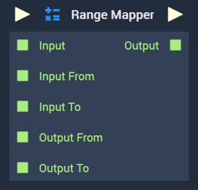
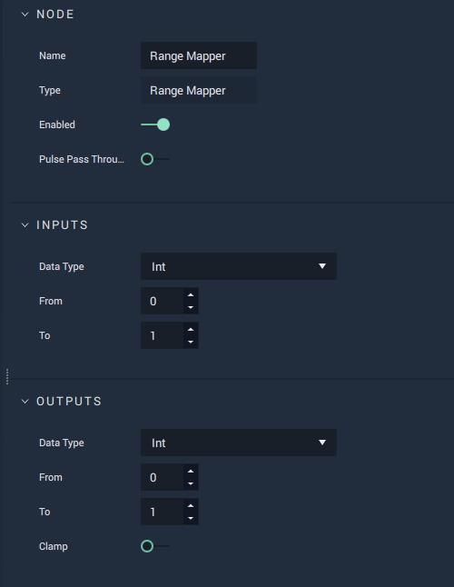

# Range Mapper

## Overview

**Range Mapper** transforms a single numerical value, from its relative position in a given reference range, to a new value within a second target range.

In the event that `Input` is outside of the reference \(input\) range, `Clamp` determines whether the `Output` should be clamped within the target range or transformed to its relative value outside of the range.

| `Input` | Input Range | Output Range | `Clamp` | `Output` |
| :--- | :--- | :--- | :--- | :--- |
| 0.5 | 0-1 | 0-100 | ✔ or ✖ | 50 |
| 20 | 0-100 | 100-0 | ✔ or ✖ | 80 |
| 1.5 | 0-1 | 0-360 | ✔ | 360 |
| 1.5 | 0-1 | 0-360 | ✖ | 540 |

[**Scope**](../overview.md#scopes): **Project**, **Scene**, **Function**, **Prefab**.

## Attributes

### Inputs

| Attribute | Type | Description |
| :--- | :--- | :--- |
| `Data Type` | **Drop-down** | The type of data that will be plugged into the `Input`, `Input From`, and `Input To` **Sockets**. |
| `From` | _Defined in the `Data Type` **Attribute**_. | The default beginning of the reference range, if there is nothing attached to the `Input From` **Socket**. |
| `To` | _Defined in the `Data Type` **Attribute**_. | The default end of the reference range, if there is nothing attached to the `Input To` **Socket**. |

### Outputs

| Attribute | Type | Description |
| :--- | :--- | :--- |
| `Data Type` | **Drop-down** | The type of data that will be plugged into the `Output From` and `Output To` **Sockets** and returned via the `Output` **Socket**. |
| `From` | _Defined in the `Data Type` **Attribute**_. | The default beginning of the target range, if there is nothing attached to the `Output From` **Socket**. |
| `To` | _Defined in the `Data Type` **Attribute**_. | The default end of the target range, if there is nothing attached to the `Output To` **Socket**. |
| `Clamp` | **Bool** | Whether the `Output` should be clamped within the target range or transformed to its relative value outside of the range. |

## Inputs

| Input | Type | Description |
| :--- | :--- | :--- |
| _Pulse Input_ \(►\) | **Pulse** | A standard input **Pulse**, to trigger the execution of the **Node**. |
| `Input` | _Defined in the `Data Type` **Attribute**_. | The value to be transformed/mapped. |
| `Input From` | _Defined in the `Data Type` **Attribute**_. | The beginning of the reference range. |
| `Input To` | _Defined in the `Data Type` **Attribute**_. | The end of the reference range. |
| `Output From` | _Defined in the `Data Type` **Attribute**_. | The beginning of the target range. |
| `Output To` | _Defined in the `Data Type` **Attribute**_. | The end of the target range. |

## Outputs

| Output | Type | Description |
| :--- | :--- | :--- |
| _Pulse Output_ \(►\) | **Pulse** | A standard output **Pulse**, to move onto the next **Node** along the **Logic Branch**, once this **Node** has finished its execution. |
| `Output` | _Defined in the `Data Type` **Attribute**_. | The transformed value. |

## See Also

* [**Clamp**](clamp.md)

