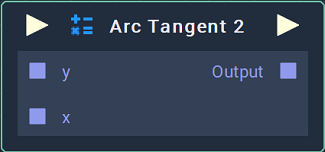
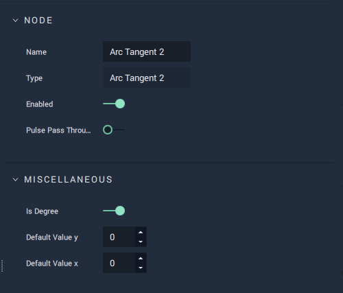

# Overview

The **Arc Tangent 2** **Node** takes two **Float** values, $y$ and $x$, and returns $atan2(y,x)$. The result can be obtained in degrees \(°\) or radians \(rad\).

The function $atan2(y,x)$ is of common use in computer science and can be equivalently defined as:

* The angle $\theta$ in the _Euclidean plane_ between the positive $X$ axis and the ray connecting the origin and the point $(x,y)$.
* The phase $\theta$ of the complex number $x+iy$. That is, the angle $\theta \in (-\pi, \pi]$ such that $x=r\cos\theta$ and $y=r\sin\theta$, where $r=\sqrt{x^2+y^2}$.

[**Scope**](../../overview.md#scopes): **Project**, **Scene**, **Function**, **Prefab**.

  

# Attributes

### Miscellaneous

| Attribute | Type | Description |
| :--- | :--- | :--- |
| `Is Degree` | **Bool** | Determines whether the `Output` value is given in degrees \(°\) or radians \(rad\). |
| `Default Value y` | **Float** | The default value of `Input Y`, if no value is provided in the **Input** **Socket**. |
| `Default Value x` | **Float** | The default value of `Input X`, if no value is provided in the **Input Socket**. |

# Inputs

|Input|Type|Description|
|---|---|---|
|*Pulse Input* (►)|**Pulse**|A standard **Input Pulse**, to trigger the execution of the **Node**.|
| `y` | **Float** | The $y$ input value. |
| `x` | **Float** | The $x$ input value. |

# Outputs

|Output|Type|Description|
|---|---|---|
|*Pulse Output* (►)|**Pulse**|A standard **Output Pulse**, to move onto the next **Node** along the **Logic Branch**, once this **Node** has finished its execution.|
| `Output` | **Float** | The value of $atan2(y,x)$, either in degrees \(°\) or radians \(rad\) according to the `Is Degree` **Attribute**. |

# See Also

* [**Trigonometry**](./)
* [**Radian-Degree Converter**](radian-degree-converter.md)

# External Links

* [_atan2_](https://en.wikipedia.org/wiki/Atan2) on Wikipedia.

