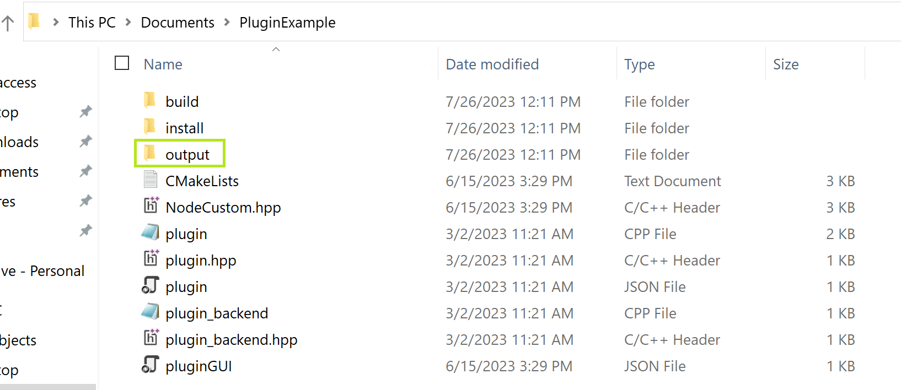
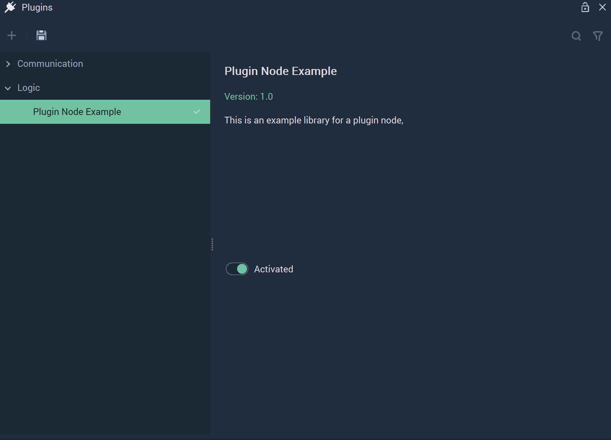
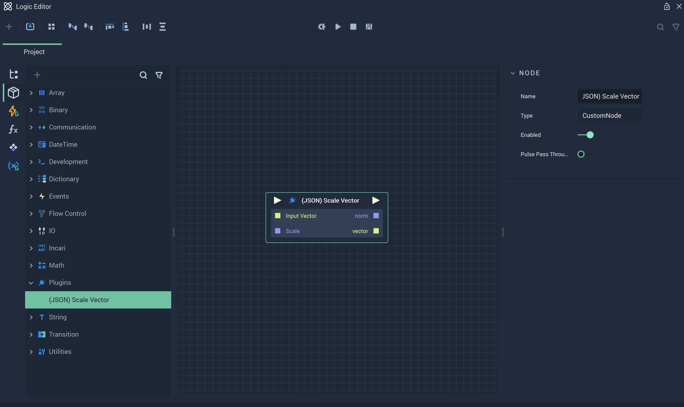

## Introduction

The **Plugins** **Nodes** appear once a **Logic Plugin** is activated. This process will be described in detail. They allow users to customize their **Logic**. 

**Logic Plugins** allow the user to add their own customized **Nodes** to their **Projects**, expanding the capabilities of **Incari**. Below is just one example which ultimately provides one **Node** at the end of the process. 

# Example 

The example **Logic Plugin** is shipped with **Incari** and includes one **Node**: the [**Scale Vector Node**](jsonscalevector.md). This **Node** appears after a particular process. The user requires access to the *Windows PowerShell* and the folder in which their **Incari Studio** appears, along with all its files. The user will also need to install [*CMake*](https://cmake.org/) and make sure it is added to PATH upon installation. 

After clicking on the **Incari Studio** folder, its files should look something like this: 

Locate the `PluginExample` folder within the `sdk` folder. If you do not have administrative privileges, copy that to a folder where you have all permissions, such as `Documents`. 

This is necessary if the user does not have permission to write to `C:/Program Files`. If the user has administrative rights and can use these when using the *Windows PowerShell* (more on that below), they do not have to copy anything over to `Documents` and can follow this process in place. Similarly, if **Incari Studio** was installed somewhere that a non-administrative user has rights to, like the `Documents` folder, everything can be done in place as well. 

Once that is done, open the *Windows PowerShell* and choose the file path pointing to the `PluginExample\build` in `Documents` as directory. This can be done by using the command `cd file\path`.

Next, the user must use the following command:

` cmake .. -G "Visual Studio 17 2022" -A x64 -DINCARI_DIR="file\path"` 

Here, copy everything exactly and replace `file\path` with the installation path of **Incari Studio**. This will likely be in the `Program Files` folder on your *Windows* device. 

The resulting output of the above command is as follows:

The second crucial command to run is:

`cmake --build . --config Release`

When this command has finished running, the user can check back in the `PluginExample` folder that everything executed properly.

The contents of the `output` folder (`plugins`) needs to be copied into the installation folder of the user's **Incari Studio**. Please note that elevated rights might be required to do so (depending on the actual installation path).

Now it's time to open **Incari Studio**. When it's up and running, the user can check that the **Plugins** and the **Logic Editor** have the new data created during the previous process. 

Following this process, the user will have successfully added the example **Plugin** to **Incari**. This **Plugin** includes the [**Scale Vector Node**](jsonscalevector.md)

## Contents

* [**(JSON) Scale Vector**](jsonscalevector.md)