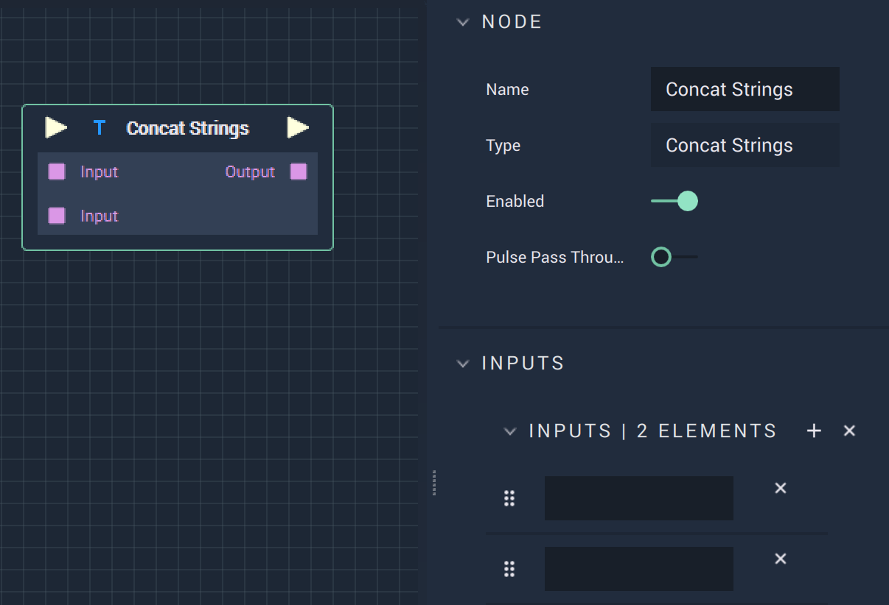

# Overview

**Concat Strings** joins two or more **Strings** into one new **String**. 

# Attributes

|Attribute|Type|Description|
|---|---|---|
|`Inputs`|**User Input**|The **Strings** to be concatenated. The user can add more elements with the `+` or delete an element with the `x`. |

# Inputs

|Input|Type|Description|
|---|---|---|
|*Pulse Input* (►)|**Pulse**|A standard **Input Pulse**, to trigger the execution of the **Node**.|
|`Input`|**String**|The **Strings** to be concatenated. The number of `Inputs` matches the number of elements in the **Attributes**.|

# Outputs

|Output|Type|Description|
|---|---|---|
|*Pulse Output* (►)|**Pulse**|A standard **Output Pulse**, to move onto the next **Node** along the **Logic Branch**, once this **Node** has finished its execution.|
|`Output`|**String**|The concatenated **String**.|

# External Links

* Information about [*Concatenation*](https://en.wikipedia.org/wiki/Concatenation) on Wikipedia.
