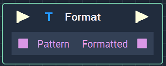

# Overview

The **Format** **Node** receives a **Pattern** **String** that can contain *format specifiers* and data as a chosen number of parameters. It then outputs the **String** formatted with the parameters in place of the *format specifiers*. The *format specifiers* define the type of data that will fill them and the format the data will be shown in.

This **Node** is useful for when data needs to presented within a text. For example, to show the current temperature. For this, we can use the **Pattern** **String** `The current temperature is %f °C`, where `%f` is the _format specifier_ that indicates that a **Float** value will take that place in the final formatted **String**. The value of the current temperature has to be given to the **Node** as a **Float** value in the corresponding parameter **Input Socket** and then, if the current temperature is, say, `20.3` degrees Celsius, the formatted **String** that the **Node** outputs will be `The current temperature is 20.3°C`.

The possible *format specifiers* are shown in the table below.

| *Format specifier* | **Type**|
|---|---|
| %c | Character |
| %d | Signed decimal integer |
| %e | Scientific notation |
| %f | Float |
| %i| Integer|
| %o | Unsigned octal |
| %s | String |
| %u | Unsigned decimal integer |
| %x | Unsigned decimal integer |

# Attributes

## Inputs

|Attribute|Type|Description|
|---|---|---|
| `Default Pattern` | **String** | The **Pattern String**, if none is given in the `Pattern` **Input Socket**. |

## Arguments

|Attribute|Type|Description|
|---|---|---|
| `Parameter [n]` | **Drop-down** | The parameter value, if none is given in the corresponding **Input Socket**.  |

# Inputs

|Input|Type|Description|
|---|---|---|
|*Pulse Input* (►)|**Pulse**|A standard **Input Pulse**, to trigger the execution of the **Node**.|
| `Pattern` | **String** | The **Pattern String**. |
| `Parameter [n]` | **Drop-down** | The parameter value. |

# Outputs

|Output|Type|Description|
|---|---|---|
|*Pulse Output* (►)|**Pulse**|A standard **Output Pulse**, to move onto the next **Node** along the **Logic Branch**, once this **Node** has finished its execution.|
| `Formatted` | **String** | The formatted **String**, with the parameters replacing the *format specifiers*. |

# See Also

* [**Formatarray**](formatarray.md)

# External Links

* [_Printf Format String_](https://en.wikipedia.org/wiki/Printf_format_string) on Wikipedia.
* [_Printf](https://www.cplusplus.com/reference/cstdio/printf/) on cplusplus.com.