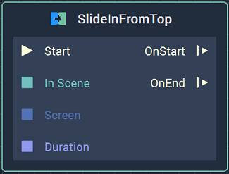
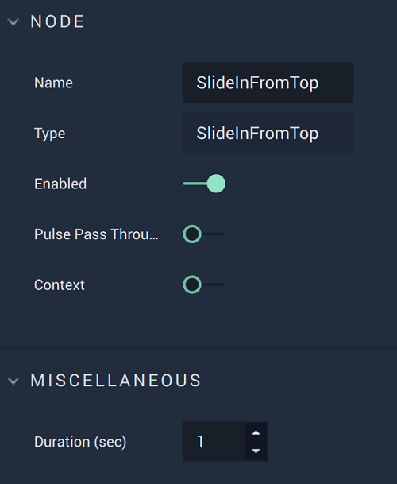

# Overview

The **SlideInFromTop Node** applies a **Transition** from the current **Scene** to the chosen **Scene**. Starting off-screen, the chosen **Scene** moves in from the top of the **Screen**. This **Transition** leads to the chosen **Scene** pushing the previous **Scene** to the bottom, the latter of which disappears from view as the **Transition** ends and is replaced by the former.  

# Attributes

|Attribute|Type|Description|
|---|---|---|
|`Duration (sec)`|**Float**|The duration, in seconds, of the **Transition**, if none is given in the **Input Socket**.|

# Inputs

|Input|Type|Description|
|---|---|---|
|`Start` (►)|**Pulse**|A standard **Input Pulse**, to trigger the execution of the **Node**.|
| `In Scene` | **SceneID** | The **Scene** to which the current **Scene** will **Transition** to. |
| `Screen` | **ScreenID** | The **Screen** that contains the initial and final **Scenes**. |
| `Duration` | **Float** | The duration, in seconds, of the **Transition**. |

# Outputs

|Output|Type|Description|
|---|---|---|
| `OnStart` (►) | **Pulse** | Flows to the next **Node** following **SlideInFromTop** when the **Transition** starts. |
| `OnEnd` (►) | **Pulse** | Flows to the next **Node** following **SlideInFromTop** when the **Transition** ends.  |

# See Also

* [**SlideInFromBottom**](slideinfrombottom.md)
* [**SlideInFromRight**](slideinfromright.md)
* [**SlideInFromLeft**](slideinfromleft.md)

