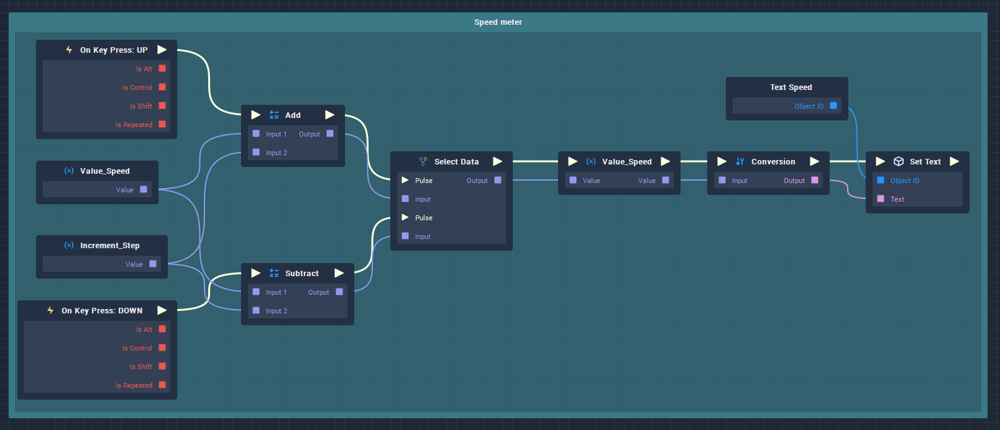

# Group

## Overview

#### Example Node

A **Group Node** is used as a container for other **Logic**. As the color, opacity, size, and name can all be changed, it is very useful for management and organization.

The easiest way to create a **Group** is to select some **Nodes** and then press `Ctrl` + `G`, but it is also available in the right-click context menu.

Another advantage of the **Group Node** is that, by changing the `Name` **Attribute** you can easily create descriptive comments for your blocks of **Logic**. When you zoom out beyond a certain threshold within the **Logic Editor**, text on **Nodes** is no longer rendered, however, the _names_ of the **Group Nodes** are.

## Attributes

### Color

| Attribute | Type | Description |
| :--- | :--- | :--- |
| `Color` | **Color** | The **Color** of the **Group Node**. |
| `ZIndex` | **Int** | The `ZIndex` determines the stack order of the **Group** **Node**. Therefore a **Group** **Node** with a higher `ZIndex` will be stacked in front of a **Group** **Node** with a lower `ZIndex` in the **Logic Editor**. |
| `Content Alpha` | **Int** | The _alpha_ value of the **Group** **Node**'s color space. |

## Usage

