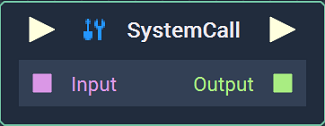
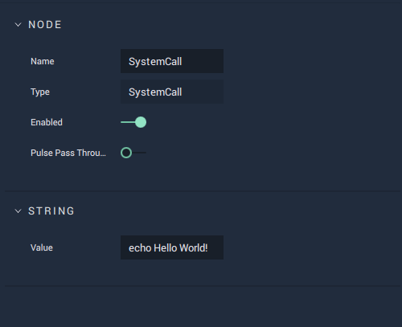

# System Call

## Overview

The **SystemCall Node** allows the user to use any commands provided by the operating system \(i.e. _Windows_, _Linux_, etc.\).

*Scope*: **Project**, **Scene**, **Function**, **Prefab**

## Attributes

| Attribute | Type | Description |
| :--- | :--- | :--- |
| `Value` | **String** | The desired command. |

## Inputs

| Input | Type | Description |
| :--- | :--- | :--- |
| _Pulse Input_ \(►\) | **Pulse** | A standard **Input Pulse**, to trigger the execution of the **Node**. |
| `Input` | **String** | The desired command. |

## Outputs

| Output | Type | Description |
| :--- | :--- | :--- |
| _Pulse Output_ \(►\) | **Pulse** | A standard **Output Pulse**, to move onto the next **Node** along the **Logic Branch**, once this **Node** has finished its execution. |
| `Output` | **Int** | The resulting output of a command. |

## External Links

* An explanation of [_OS commands_](https://www.tutorialspoint.com/what-are-system-calls-in-operating-system) and some examples.

